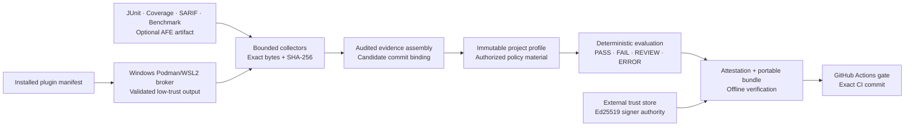

# ForgeGate

**Evidence in. Auditable release decision out.**

ForgeGate is a local-first Python release-assurance platform that normalizes
engineering evidence, evaluates versioned policies, and produces deterministic,
reviewable release decisions.

[](https://github.com/Carlos-0798/forgegate/actions/workflows/ci.yml)

## Current status

> **Testable Windows Alpha `0.1.0a1`** — the end-to-end local CLI assurance
> workflow, authenticated local Dashboard vertical slice, and brokered Windows
> plugin path are implemented. The product is not production-ready.

The current checkpoint demonstrates:

- fail-closed collection of JUnit, coverage, SARIF, benchmark, and optional
  Analog Validation Studio artifacts;
- deterministic policy decisions over commit-bound evidence;
- immutable project profiles, release candidates, and append-only audit history;
- content-addressed attestations and portable assurance bundles;
- an Ed25519-authenticated, project-authorized, loopback-only REST API;
- a same-origin local Dashboard for activation, status, project discovery,
  candidate creation, and audit inspection without browser-held signing keys;
- offline GitHub Actions gating without GitHub API write permissions; and
- rootless Podman/WSL2 isolation for the exact Windows plugin runs that passed
  the retained hostile-fixture checks.

ForgeGate has not accessed an MSP430 board, performed an analog measurement, or
been approved for LAN, internet, shared-host, or production deployment.

## Architecture and workflow



The core stays domain-neutral. Analog Validation Studio integration consumes a
frozen public JSON contract without importing the upstream runtime. MSP430
support remains a planned optional collector and is not a runtime or hardware
dependency.

## Verified results

| Gate | Current result | Evidence boundary |
|---|---|---|
| Full Python suite | 821 passed, 3 skipped | Local host test; skips require unavailable Windows symlink creation |
| Branch-aware coverage | 95.20% across 9,565 statements and 2,634 branches | Local host test |
| Static quality | Ruff, formatting, and strict mypy passed across 84 source/tool files | Local host test |
| Contracts | 41 document and 2 artifact JSON Schemas plus direct-API and Dashboard-BFF OpenAPI passed drift checks | Local host test |
| Packaging | sdist/wheel build and clean-environment install smoke passed | Local host test |
| User interaction smoke | 33/33 expected CLI and authenticated REST outcomes matched | Local host test; ephemeral key/database, no hardware |
| Dashboard automation | 41 focused tests passed; Dashboard package reached 98.49% branch-aware coverage | Local host test; security, session, cursor pagination, fault-presentation harness, asset/evidence integrity, BFF, contract, and CLI boundary |
| Dashboard browser interaction | Edge and Chrome keyboard/focus, 129-record pagination, 390 px responsive, 409/413/422/429/500 recovery, and clean-console paths passed; installed-wheel Edge read passed | Windows local browser test; 409/413/429/500 use a test-only presentation harness; exact zoom matrix and assistive technology remain `NOT_RUN` |
| Windows plugin controls | 18/18 clean-wheel controls passed with the fixed pure-Python fixture | Live local WSL2/Podman test; no general publisher or plugin trust claim |
| Cross-platform CI | `verify.py`, `release_smoke.py`, and the generic Action smoke passed | [GitHub Actions run 33839976122](https://github.com/Carlos-0798/forgegate/actions/runs/33839976122); hosted CI did not run live Podman fixtures |
| Hardware/device behavior | Not exercised by ForgeGate | Out of scope |

See the [verification matrix](docs/VERIFICATION_MATRIX.md) for capability-level
status, the [interaction acceptance report](reports/INTERACTION_ACCEPTANCE_REPORT_2026-09-04.md)
for expected-versus-actual samples, and the
[software integrity and interaction audit](reports/SOFTWARE_INTEGRITY_INTERACTION_AUDIT_2026-09-03.md)
for the accepted security/package checkpoint. Historical phase reports are
retained under [`reports/`](reports/README.md) instead of being presented as
current results.

## Key design decisions

- **Collection is not a decision.** A successful collector only contributes
  evidence; policy evaluation remains a separate explicit action.
- **Integrity is not authenticity.** SHA-256 binds exact bytes and associations.
  Signer authentication requires a separately managed Ed25519 trust record.
- **History is append-only.** Candidate changes use idempotency keys and
  optimistic revisions; exact replay is distinct from conflicting reuse.
- **Policy authority is frozen.** A candidate retains the immutable project
  profile and exact policy bytes that authorized its decision.
- **Portable verification is explicit.** A bundle can be checked without its
  source database, but source-artifact bytes and trusted time are not implied.
- **Plugins are untrusted inputs.** Discovery does not import plugin code. The
  Windows broker owns I/O, enforces the retained run plan, and does not promote
  plugin output above `unsigned_local` / `declared` evidence.
- **Peer projects keep their evidence labels.** ForgeGate never converts AFE
  software results, replay data, or future MSP430 reports into physical proof.

## Quick start

Requirements: Python 3.12. Live plugin execution additionally requires the
documented Windows 11, WSL2, and rootless Podman environment.

```powershell
.\tools\setup_environment.ps1
.\.venv\Scripts\python.exe tools\verify.py
.\.venv\Scripts\python.exe tools\interaction_smoke.py
.\.venv\Scripts\python.exe tools\release_smoke.py
.\.venv\Scripts\python.exe -m forgegate init work\sample-project
```

Validate the committed generic project and evaluate its reproducible PASS
fixture:

```powershell
.\.venv\Scripts\python.exe -m forgegate validate-config `
  examples\sample-python-api\forgegate.yaml

.\.venv\Scripts\python.exe -m forgegate evaluate-policy `
  examples\sample-python-api\policies\pull-request.yaml `
  examples\sample-python-api\evidence\pass-bundle.json `
  --evaluated-at 2026-08-30T21:00:00Z
```


The image is a formatted excerpt of commands rerun against this checkpoint, not
a hardware or production screenshot. The exact commands, complete output, and
evidence label are retained in the [reproducible CLI walkthrough](docs/DEMO.md).

Decision exits are stable: `0` PASS, `1` FAIL, `2` REVIEW, and `3` ERROR.
ForgeGate does not run the build or authenticate evidence while evaluating it.

The current Alpha includes a narrow same-origin local Dashboard. Start it with
an owner-managed trust store and an initialized project database:

```powershell
.\.venv\Scripts\forgegate.exe dashboard `
  --database work\forgegate.db `
  --trust-store work\trust-store.json

# In another terminal, approve the code displayed by the page:
.\.venv\Scripts\forgegate.exe dashboard-activate FG-ABCDE-FGHJK `
  --identity work\operator-identity.json `
  --private-key work\operator-private-key.pem `
  --role operator `
  --project sample-api
```

The browser receives an opaque HttpOnly cookie, never the raw API Bearer token
or private signing key. The implemented pages cover activation, Overview,
Projects, and candidate list/create/detail/audit. Evidence upload, policy
execution, assurance export, plugin execution, and administration remain
visibly planned. Swagger UI and ReDoc stay disabled; the committed,
drift-checked OpenAPI document remains the direct API reference.


Both Dashboard images are real Windows Chrome captures using one generic local
fixture. The [portfolio evidence gallery](docs/PORTFOLIO_EVIDENCE.md) retains
the candidate-list, strict-validation-error, and 129-record pagination images,
plus exact sample inputs, output cross-checks, dimensions, SHA-256 digests, and
claim boundaries. These captures demonstrate only the implemented Alpha
interaction surface; they are not hardware, evidence-authenticity, production,
or release-approval evidence.

For plugin inspection, API authentication, candidate persistence, bundle
signing, and GitHub gate commands, use the [CLI and workflow guide](docs/DEMO.md)
and architecture index rather than copying unreviewed commands from screenshots.

## Repository layout

| Path | Purpose |
|---|---|
| [`src/forgegate/`](src/forgegate/) | Domain models, collectors, policy engine, persistence, CLI, REST API, and plugin boundaries |
| [`tests/`](tests/) | Unit, adversarial, integration, Golden, migration, and contract-drift tests |
| [`schemas/`](schemas/) | Committed JSON Schema and OpenAPI contracts |
| [`examples/`](examples/) | Generic reproducible project, policies, evidence, and artifacts |
| [`docs/`](docs/README.md) | Architecture, security, compatibility, status, roadmap, and walkthroughs |
| [`reports/`](reports/README.md) | Current acceptance evidence plus immutable historical phase reports |
| [`tools/`](tools/) | Environment setup, full verification, and clean-install release smoke |

Start with [project status](docs/PROJECT_STATUS.md), the
[documentation index](docs/README.md), and the
[verification matrix](docs/VERIFICATION_MATRIX.md). Security-sensitive behavior
and reporting instructions are documented in [SECURITY.md](SECURITY.md).

## Known limitations

- The authenticated API is loopback-only and has no TLS, reverse-proxy trust,
  hostile-local-user defense, or remote-deployment approval.
- The local Web Dashboard is a narrow Alpha surface. Evidence/decision/
  assurance/plugin/administration workflows are not implemented there, and
  the exact 100–200% zoom matrix and assistive technologies remain `NOT_RUN`.
  The Dashboard BFF has a separate generated and drift-checked
  OpenAPI contract without exposing interactive docs.
- Sessions, authentication rate state, and trust-store distribution are not
  durable or distributed; time is caller/server supplied rather than trusted.
- General third-party plugin trust is not established. Native extensions,
  dependency-rich plugins, remote acquisition, and Linux/macOS execution
  backends are unsupported.
- The GitHub bridge performs offline bundle/commit gating only. It does not add
  custom Checks, PR annotations, artifact upload, OIDC identity, or API writes.
- Database authorization, backup/repair, managed key custody, online revocation,
  and administrator-resistant audit logging are not implemented.
- MSP430 collection, AFE/MSP430 runtime integration, and every hardware action
  remain out of scope.
- No production deployment or public release has been authorized.

These constraints are product boundaries, not implied future results. See the
[threat model](docs/security/THREAT_MODEL.md) for the complete trust analysis.

## Roadmap

The next maturity gates are:

1. finish the remaining exact-zoom, assistive-technology, and uncommon browser-
   error checks for the implemented Dashboard slice;
2. freeze a public MSP430 report contract before adding an optional collector;
3. establish publisher provenance and broader hostile-plugin compatibility;
4. design TLS/proxy identity, durable security state, retention/export, and
   managed key lifecycle before considering non-loopback deployment; and
5. consider GitHub Checks, signed CI provenance, OIDC, and artifact publication
   only as separately authorized integrations.

Completed acceptance-level work and remaining tasks are tracked in
[docs/ROADMAP.md](docs/ROADMAP.md). Roadmap items are not claims of delivery.

## License status

No open-source license has been selected. The current private-development copy
is all rights reserved and must not be published or redistributed until the
owner makes an explicit license and release decision.
