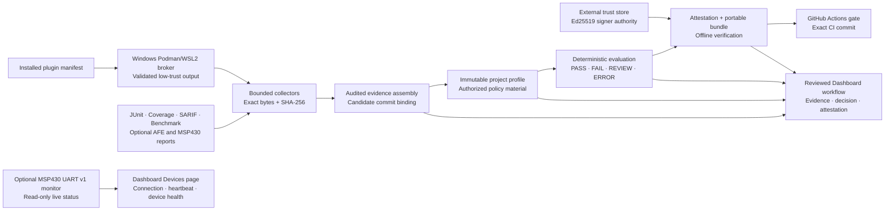
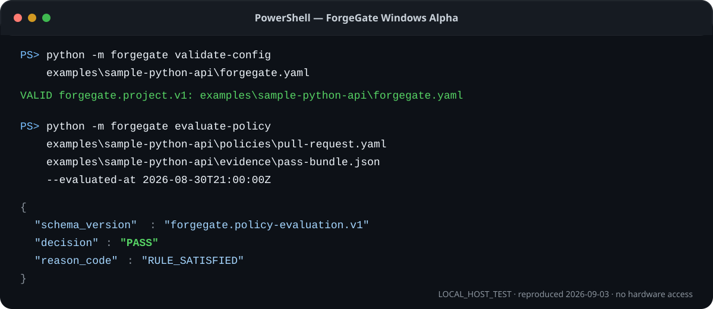
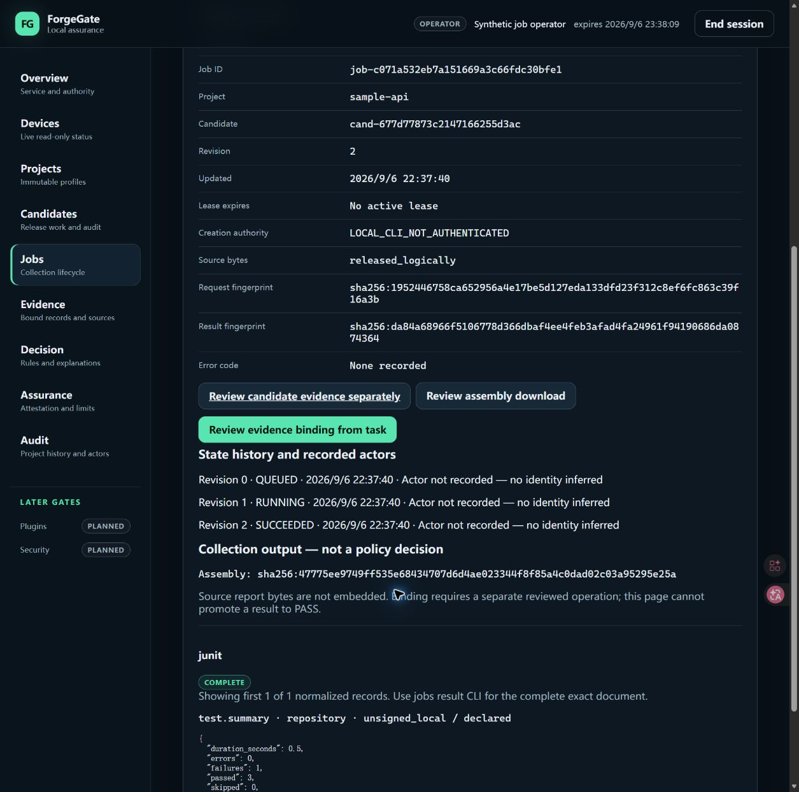
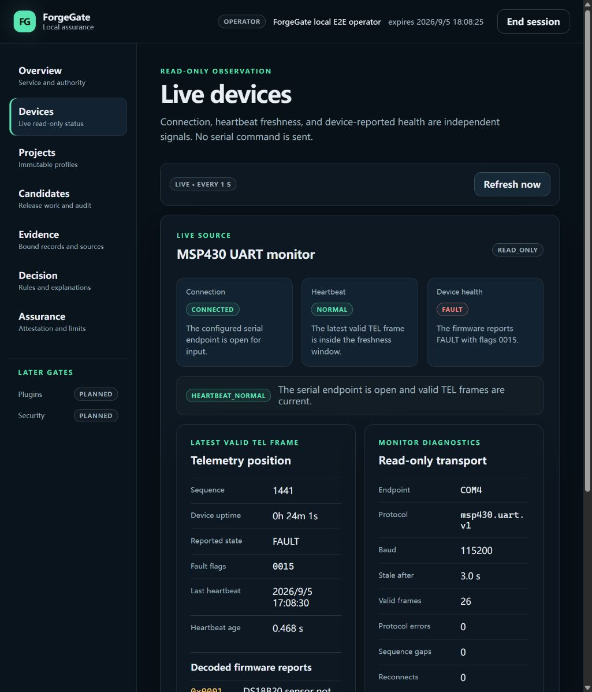
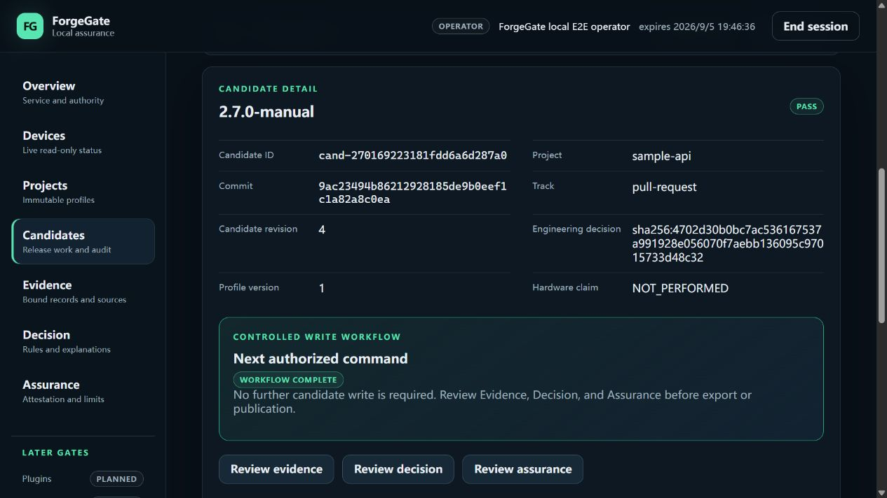
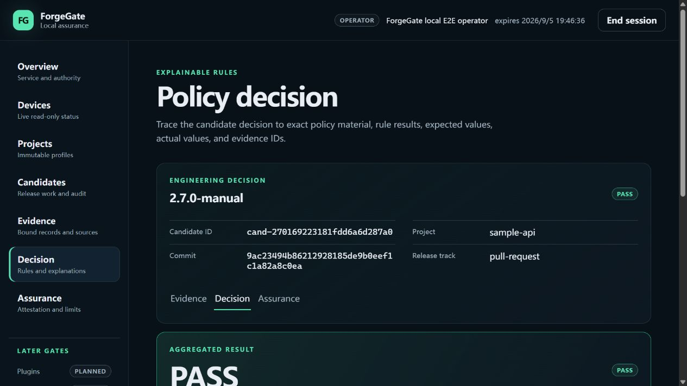
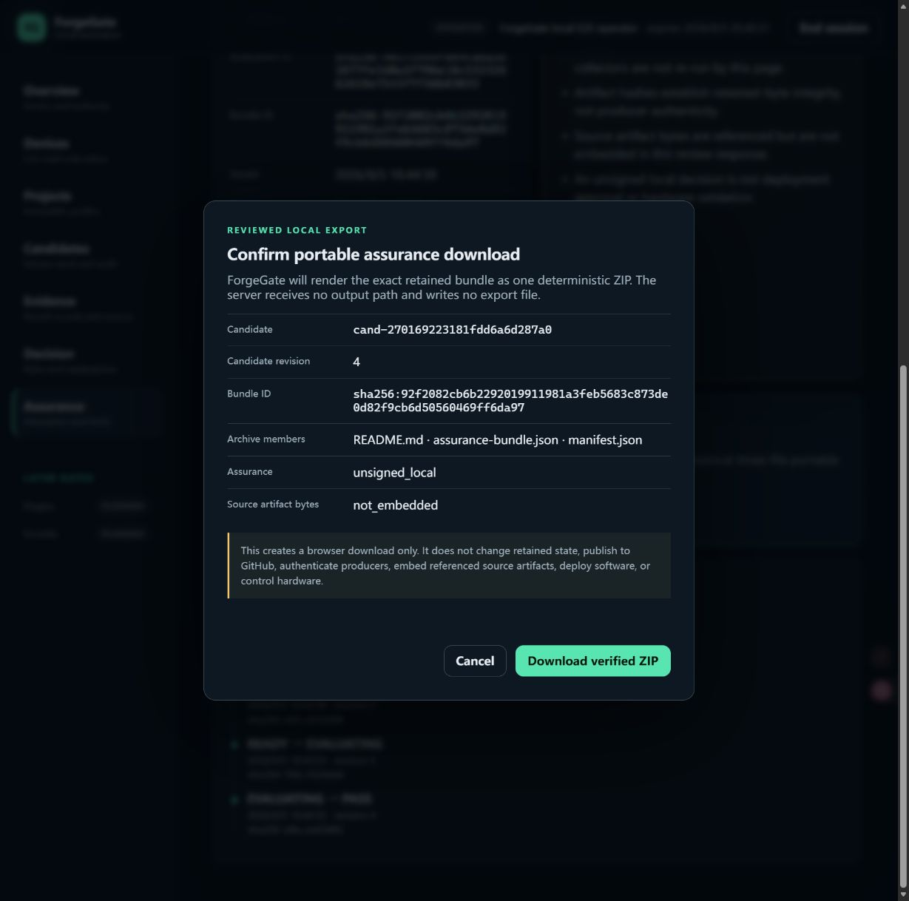

# ForgeGate

**Evidence in. Auditable release decision out.**

ForgeGate is a local-first Python release-assurance platform that normalizes
engineering evidence, evaluates versioned policies, and produces deterministic,
reviewable release decisions.

[](https://github.com/Carlos-0798/forgegate/actions/workflows/ci.yml)

## Current status

> **Testable Windows Alpha `0.1.0a1`** — the end-to-end local CLI assurance
> workflow, reviewed local Dashboard actions, optional read-only MSP430 live
> status, artifact-only MSP430 report collection, candidate-bound assurance
> download, and brokered Windows plugin path are implemented. The product is
> not production-ready.

The current checkpoint demonstrates:

- fail-closed collection of JUnit, coverage, SARIF, benchmark, and optional
  Analog Validation Studio artifacts;
- bounded operator-only JUnit and combined JUnit + Cobertura/LCOV browser
  previews with exact-byte hashing, explicit warning retention and separately
  confirmed immutable binding; [collection boundaries](docs/DASHBOARD_COLLECTION_CONTRACT.md);
- loopback HTTP/HTML diagnostics and an explicit Windows foreground launcher
  with [startup and recovery guidance](docs/WINDOWS_DASHBOARD_OPERATIONS.md);
- consistent candidate-store snapshots and offline backup validation with
  [no-overwrite and private-data boundaries](docs/STORE_BACKUP_OPERATIONS.md);
- [coordinated candidate/job backup and recovery](docs/WORKSPACE_RECOVERY.md),
  including exact historical association checks, restore to a new directory,
  and non-destructive retention plans;
- [reviewed terminal-job archival](docs/JOB_ARCHIVAL.md) backed by exact verified
  snapshots, preserving history and duplicate-request protection while freeing
  logical job/result quota; Dashboard details disclose external-backup dependencies;
- [durable local report jobs](docs/COLLECTION_JOBS.md) with idempotent submission,
  explicit execution/cancellation, expired-lease recovery and bounded pending
  input retention; v2 records expose non-credential execution ownership and
  bounded lease-renewal history, while cancellation is checked between parser
  stages; CLI and explicitly reviewed browser submission/execution;
- [opt-in Dashboard job management](docs/DASHBOARD_JOBS.md): project-scoped
  list/detail/results, reviewed submission/parsing, cancellation and expired-lease
  recovery with retained operator attribution, plus exact assembly download and
  separately confirmed immutable evidence binding; no automatic binding, candidate
  transition or policy PASS;
- deterministic policy decisions over commit-bound evidence;
- immutable project profiles, release candidates, and append-only audit history;
- content-addressed attestations and portable assurance bundles;
- an Ed25519-authenticated, project-authorized, loopback-only REST API;
- a same-origin local Dashboard for activation, status, project discovery,
  candidate creation, reviewed lifecycle/evidence/evaluation/attestation
  actions, audit and assurance inspection, operator-reviewed portable bundle
  download, and optional live device status without browser-held signing keys;
- offline GitHub Actions gating without GitHub API write permissions; and
- rootless Podman/WSL2 isolation for the exact Windows plugin runs that passed
  the retained hostile-fixture checks.

ForgeGate has read public UART v1 telemetry from a connected MSP430 board in an
explicitly enabled, input-only Windows session. It has not sent a device command,
flashed firmware, validated a physical measurement, converted telemetry into
release evidence, or been approved for LAN, internet, shared-host, or production
deployment.

## Architecture and workflow



The core stays domain-neutral. Analog Validation Studio integration consumes a
frozen public JSON contract without importing the upstream runtime. The optional
MSP430 live monitor consumes the frozen public UART v1 protocol without importing
the upstream runtime, sending serial bytes, or changing generic operation.
A separate strict collector consumes `forgegate.msp430-validation-report.v1`
artifacts without importing upstream code or opening a device. Live UART state is
never converted into candidate evidence.

## Verified results

| Gate | Current result | Evidence boundary |
|---|---|---|
| Full Python suite | 1195 passed, 3 skipped | Local host test; skips require unavailable Windows symlink creation |
| Branch-aware coverage | 95.66% across 12,060 statements and 3,154 branches | Local host test |
| Static quality | Ruff, formatting, and strict mypy passed across 107 source/tool files | Local host test |
| Reviewed job archival | 46 new regressions; 94 combined archive/backup cases, 100% focused branch coverage; actual Edge detail and clean-wheel CLI recovery | Local synthetic test; history/idempotency retained; logical quota only; original external backups required |
| Coordinated workspace recovery | 48 focused cases; backup/CLI modules 100% branch-aware coverage; paired snapshots, restored-copy execution and retention planning | Local synthetic test; no live replacement, automatic purge, encryption or power-loss certification |
| Durable local report jobs | 99 focused Python cases plus actual synthetic browser execution; CLI lifecycle, v1/v2-to-v3 store migration, cooperative cancellation/renewal, exact browser export and reviewed binding | Local synthetic test; no automatic worker, mid-parser preemption, candidate transition, policy decision or hardware |
| Candidate-store backup | 27 focused cases; backup module 100% branch-aware coverage; installed CLI round trip passes | Local host test; no automatic restore, encryption or blanket domain validation |
| Contracts | 49 document and 3 artifact JSON Schemas plus direct-API and Dashboard-BFF OpenAPI (27 paths, 29 operations) passed drift checks | Local host test |
| Packaging | sdist/wheel build and clean-environment install smoke passed | Local host test |
| User interaction smoke | 33/33 expected CLI and authenticated REST outcomes matched | Local host test; ephemeral key/database, no hardware |
| Dashboard automation | 128 TypeScript host interaction tests passed, including 55 job-management/submission/handoff/archive cases | Local host test; [Phase 40 actual Edge checks](reports/PHASE_40_JOB_ARCHIVAL_ACCEPTANCE.md) verify archive disclosure/history separately; not exhaustive browser/OS certification |
| Dashboard browser interaction | Full reviewed Edge workflow, Edge/Chrome keyboard/focus, 129-record pagination, 390 px responsive, 409/413/422/429/500 recovery, exact Edge 100–200% zoom, and clean-console paths passed | Windows local browser test; uncommon errors use a zero-write presentation harness; Narrator is bounded PASS, while spoken output, high contrast, and real Remote Desktop remain open |
| MSP430 report collector | 34 focused tests plus clean-wheel CLI collection passed; one LaunchPad HIL migration fixture produced 17 normalized records with retained warnings | Local artifact test; the fixture is a historical upstream result, not a new run or physical-measurement claim |
| MSP430 live status | COM4 opened input-only at 115200 8-N-1; authenticated Devices page showed `CONNECTED`, heartbeat `NORMAL`, device `FAULT`, flags `0015`; sequence advanced 58007→58017 over 10 seconds with 10 accepted frames and no sequence gap | Owner-authorized Windows physical-device observation; one earlier invalid frame was rejected, no command or firmware/debug action, measurement validation, release evidence, or long-duration stability claim |
| Windows plugin controls | 18/18 clean-wheel controls passed with the fixed pure-Python fixture | Live local WSL2/Podman test; no general publisher or plugin trust claim |
| Cross-platform CI | `verify.py`, `release_smoke.py`, and the generic Action smoke passed | [GitHub Actions run 33999452478](https://github.com/Carlos-0798/forgegate/actions/runs/33999452478); hosted CI did not run live Podman fixtures |
| Hardware/device behavior | Connection and UART heartbeat status observed only | Device control and measurement validation remain out of scope |

See the [verification matrix](docs/VERIFICATION_MATRIX.md) for capability-level
status, the [Phase 27 acceptance report](reports/PHASE_27_DASHBOARD_WRITE_AND_MSP430_COLLECTOR_ACCEPTANCE_REPORT.md)
for the reviewed browser/collector checkpoint, the
[interaction acceptance report](reports/INTERACTION_ACCEPTANCE_REPORT_2026-09-04.md)
for core expected-versus-actual samples, and the
[software integrity and interaction audit](reports/SOFTWARE_INTEGRITY_INTERACTION_AUDIT_2026-09-03.md)
for the accepted security/package checkpoint. Historical phase reports are
retained under [`reports/`](reports/README.md) instead of being presented as
current results.

## Key design decisions

- **Collection is not a decision.** A successful collector only contributes
  evidence; policy evaluation remains a separate explicit action.
- **Integrity is not authenticity.** SHA-256 binds exact bytes and associations.
  Signer authentication requires a separately managed Ed25519 trust record.
- **History is append-only.** Candidate changes use idempotency keys and
  optimistic revisions; exact replay is distinct from conflicting reuse.
- **Policy authority is frozen.** A candidate retains the immutable project
  profile and exact policy bytes that authorized its decision.
- **Portable verification is explicit.** A bundle can be checked without its
  source database, but source-artifact bytes and trusted time are not implied.
- **Plugins are untrusted inputs.** Discovery does not import plugin code. The
  Windows broker owns I/O, enforces the retained run plan, and does not promote
  plugin output above `unsigned_local` / `declared` evidence.
- **Peer projects keep their evidence labels.** ForgeGate never converts AFE
  software results, replay data, or MSP430 reports into physical proof.

## Quick start

Requirements: Python 3.12. Live plugin execution additionally requires the
documented Windows 11, WSL2, and rootless Podman environment.

```powershell
.\tools\setup_environment.ps1
.\.venv\Scripts\python.exe tools\verify.py
.\.venv\Scripts\python.exe tools\interaction_smoke.py
.\.venv\Scripts\python.exe tools\release_smoke.py
.\.venv\Scripts\python.exe -m forgegate init work\sample-project
```

Validate the committed generic project and evaluate its reproducible PASS
fixture:

```powershell
.\.venv\Scripts\python.exe -m forgegate validate-config `
  examples\sample-python-api\forgegate.yaml

.\.venv\Scripts\python.exe -m forgegate evaluate-policy `
  examples\sample-python-api\policies\pull-request.yaml `
  examples\sample-python-api\evidence\pass-bundle.json `
  --evaluated-at 2026-08-30T21:00:00Z
```



The image is a formatted excerpt of commands rerun against this checkpoint, not
a hardware or production screenshot. The exact commands, complete output, and
evidence label are retained in the [reproducible CLI walkthrough](docs/DEMO.md).

Decision exits are stable: `0` PASS, `1` FAIL, `2` REVIEW, and `3` ERROR.
ForgeGate does not run the build or authenticate evidence while evaluating it.

The current Alpha includes a narrow same-origin local Dashboard. Start it with
an owner-managed trust store and an initialized project database:

```powershell
.\.venv\Scripts\forgegate.exe dashboard `
  --database work\forgegate.db `
  --trust-store work\trust-store.json

# In another terminal, approve the code displayed by the page:
.\.venv\Scripts\forgegate.exe dashboard-activate FG-ABCDE-FGHJK `
  --server http://127.0.0.1:8000 `
  --identity work\operator-identity.json `
  --private-key work\operator-private-key.pem `
  --role operator `
  --project sample-api
```

Use the fresh code and exact `--server` origin shown by your page. If you start
the service with `--port 8131`, activation must also target port 8131. Replace
the identity/key paths, role, and project with your owner-managed values; the
page never accepts a private key. An expired code requires a new activation.
Connection/rate failures provide a manual retry action without auto-resubmission.

The browser receives an opaque HttpOnly cookie, never the raw API Bearer token
or private signing key. The implemented pages cover activation, Overview,
Devices, Projects, candidate list/create/detail/audit, Evidence, Decision, and
Assurance for one selected candidate, plus an operator-only project Audit
workspace. Audit supports candidate filtering, 25-event cursor pages, full
event/subject fingerprints, recorded actor identity, and refresh/back links;
missing actors remain explicitly unrecorded. An operator can explicitly review and
confirm each legal lifecycle transition, bind a complete local evidence-
assembly JSON document, evaluate exact policy-material JSON, and generate the
terminal attestation. An operator can then review the current revision, bundle
identity, exact member set, and limitations before downloading the deterministic
portable ZIP; the server accepts no output path and writes no export file.
Automatic collection, server-side file browsing, plugin execution, and
administration remain CLI/API work or visibly planned. Swagger UI and ReDoc stay disabled; the committed,
drift-checked OpenAPI document remains the direct API reference.

For an unbound COLLECTING candidate, **Collect JUnit report** accepts one raw
XML report up to 1 MiB and previews it using the existing collector. Supply the
original collection time and reported source metadata; evidence stays
`unsigned_local` / `declared`. Review counts and warnings before the separate
immutable binding confirmation. This is not automatic test execution, a durable
job queue, or multi-report collection. Original bytes are not retained.
See the [collection contract](docs/DASHBOARD_COLLECTION_CONTRACT.md) and
[synthetic acceptance samples](examples/dashboard-junit/README.md).
Real Edge acceptance now covers file selection, PASS/FAIL policy workflows,
warning consent and forbidden-XML rejection using explicitly synthetic samples.
It found and corrected a shared-policy binding defect; SQLite schema v9 permits
multiple candidates to reuse exact policy content while preserving one immutable
binding per candidate. Existing databases require a backup and explicit migration.
See the [Phase 30 report](reports/PHASE_30_JUNIT_COLLECTION_ACCEPTANCE.md).

A completed retained task now exposes two deliberately separate actions: export
the exact canonical assembly, or bind that same assembly through the existing
candidate-evidence workflow after a fresh candidate check and confirmation.



The [Phase 37 acceptance report](reports/PHASE_37_JOB_RESULT_HANDOFF_ACCEPTANCE.md)
records the actual Edge download, byte-for-byte SHA-256 validation, immutable
binding and independent CLI/store readback. Its synthetic test summary deliberately
contains one failure; the candidate stays `COLLECTING` revision 1 and no policy
decision is made. This is local host evidence, not producer authentication,
hardware validation or production approval.

For startup diagnosis, use `python -m forgegate dashboard-check --port 8131`.
The [Windows operation guide](docs/WINDOWS_DASHBOARD_OPERATIONS.md) and
[Phase 31 report](reports/PHASE_31_WINDOWS_RUNTIME_ACCEPTANCE.md) cover the
foreground launcher, failures and safe restart; this is not a background service.

MSP430 monitoring is an optional dependency and must be enabled explicitly. The
monitor enumerates and opens only the selected application UART, sets DTR/RTS
inactive before opening, reads bounded newline-delimited frames, and never calls
the serial write path:

```powershell
.\.venv\Scripts\python.exe -m pip install -e ".[msp430]"
.\.venv\Scripts\forgegate.exe dashboard `
  --database work\forgegate.db `
  --trust-store work\trust-store.json `
  --msp430-port COM4
```

The Devices page refreshes every second and separates serial connection,
heartbeat freshness, and the firmware-reported device state. `FAULT 0015` can
therefore coexist with a healthy connection and heartbeat; it is not presented
as a ForgeGate release failure. The versioned UART adapter decodes `0015` as
DS18B20 missing, NTC unavailable/out of range, and INA219 communication
unavailable while labeling those values as firmware reports rather than
ForgeGate diagnoses.



This real Windows browser capture records the owner-authorized, input-only COM4
observation described in the
[Phase 25 acceptance report](reports/PHASE_25_MSP430_LIVE_STATUS_ACCEPTANCE_REPORT.md).
It demonstrates live transport and presentation only—not sensor accuracy,
firmware correctness, release evidence, hardware control, or production
readiness.





These Edge captures show one generic, isolated workflow from DRAFT through PASS
and an `unsigned_local` attestation. Every mutation was separately reviewed;
the table and detail were reloaded from authoritative state. Exact identities,
negative input results, 100–200% zoom measurements, image hashes, and boundaries
are retained in the
[Phase 27 browser evidence](reports/DASHBOARD_PHASE27_INTERACTION_EVIDENCE_2026-09-05.json).
The [portfolio evidence gallery](docs/PORTFOLIO_EVIDENCE.md) retains the broader
Overview, candidate, validation-error, pagination, assurance, and zoom captures.
None proves producer authenticity, hardware correctness, deployment approval,
or production readiness.



The Phase 28 Edge run downloaded the candidate-bound ZIP, extracted exactly the
three canonical members, and passed the existing database-independent verifier.
The [machine record](reports/DASHBOARD_PHASE28_ASSURANCE_EXPORT_EVIDENCE_2026-09-05.json)
retains the archive hash, response contract, negative authorization/stale-state
results, screenshot hashes, and explicit non-claims.

For plugin inspection, API authentication, candidate persistence, bundle
signing, and GitHub gate commands, use the [CLI and workflow guide](docs/DEMO.md)
and architecture index rather than copying unreviewed commands from screenshots.

## Repository layout

| Path | Purpose |
|---|---|
| [`src/forgegate/`](src/forgegate/) | Domain models, collectors, policy engine, persistence, CLI, REST API, and plugin boundaries |
| [`tests/`](tests/) | Unit, adversarial, integration, Golden, migration, and contract-drift tests |
| [`schemas/`](schemas/) | Committed JSON Schema and OpenAPI contracts |
| [`examples/`](examples/) | Generic reproducible project, policies, evidence, and artifacts |
| [`docs/`](docs/README.md) | Architecture, security, compatibility, status, roadmap, and walkthroughs |
| [`reports/`](reports/README.md) | Current acceptance evidence plus immutable historical phase reports |
| [`tools/`](tools/) | Environment setup, full verification, and clean-install release smoke |

Start with [project status](docs/PROJECT_STATUS.md), the
[documentation index](docs/README.md), and the
[verification matrix](docs/VERIFICATION_MATRIX.md). Security-sensitive behavior
and reporting instructions are documented in [SECURITY.md](SECURITY.md).

## Known limitations

- The authenticated API is loopback-only and has no TLS, reverse-proxy trust,
  hostile-local-user defense, or remote-deployment approval.
- The local Web Dashboard is a narrow Alpha surface. Evidence, decision, and
  assurance review plus explicit candidate transitions, evidence binding,
  policy evaluation, attestation generation, and candidate-bound portable ZIP
  download are implemented. Automatic collection, server-side browsing,
  source-artifact export, plugin, and administration
  workflows are not. Foreground report parsing now records execution ownership,
  renews at bounded checkpoints, and observes explicit cancellation between
  stages; there is still no scheduler, background service, or arbitrary parser
  preemption. Exact 100–200% Edge zoom passes; spoken Narrator output,
  Windows high contrast, and a real Remote Desktop run remain unexecuted.
  The Dashboard BFF has a separate generated and drift-checked
  OpenAPI contract without exposing interactive docs.
- Sessions, authentication rate state, and trust-store distribution are not
  durable or distributed; time is caller/server supplied rather than trusted.
- General third-party plugin trust is not established. Native extensions,
  dependency-rich plugins, remote acquisition, and Linux/macOS execution
  backends are unsupported.
- The GitHub bridge performs offline bundle/commit gating only. It does not add
  custom Checks, PR annotations, artifact upload, OIDC identity, or API writes.
- Automatic restore/repair, database authorization, managed key custody, online revocation,
  and administrator-resistant audit logging are not implemented.
  Current-schema backup and structural verification are local CLI operations;
  they do not authenticate data or replay all domain-history invariants.
- MSP430 live status is input-only and process-local. It retains no telemetry
  history, controls no hardware, does not validate sensor values, and does not
  create release evidence. The separate artifact collector can normalize a
  strict upstream report, but it never promotes HIL to physical verification
  or accesses the live device.
- No production deployment or public release has been authorized.

These constraints are product boundaries, not implied future results. See the
[threat model](docs/security/THREAT_MODEL.md) for the complete trust analysis.

## Roadmap

The next maturity gates are:

1. complete Windows high-contrast, spoken Narrator-output, and real Remote
   Desktop evidence without claiming full accessibility certification;
2. expose read-only capacity/backup-dependency health and archived-task filtering,
   building on reviewed archival/recovery before automatic workers;
3. align future MSP430 report revisions through the frozen artifact contract
   while keeping live UART status separate from evidence;
4. establish publisher provenance and broader hostile-plugin compatibility;
5. design TLS/proxy identity, durable security state, retention/export, and
   managed key lifecycle before considering non-loopback deployment; and
6. consider GitHub Checks, signed CI provenance, OIDC, and artifact publication
   only as separately authorized integrations.

Completed acceptance-level work and remaining tasks are tracked in
[docs/ROADMAP.md](docs/ROADMAP.md). Roadmap items are not claims of delivery.

## License status

No open-source license has been selected. The current private-development copy
is all rights reserved and must not be published or redistributed until the
owner makes an explicit license and release decision.
