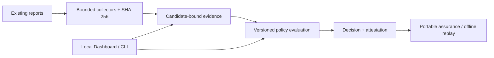
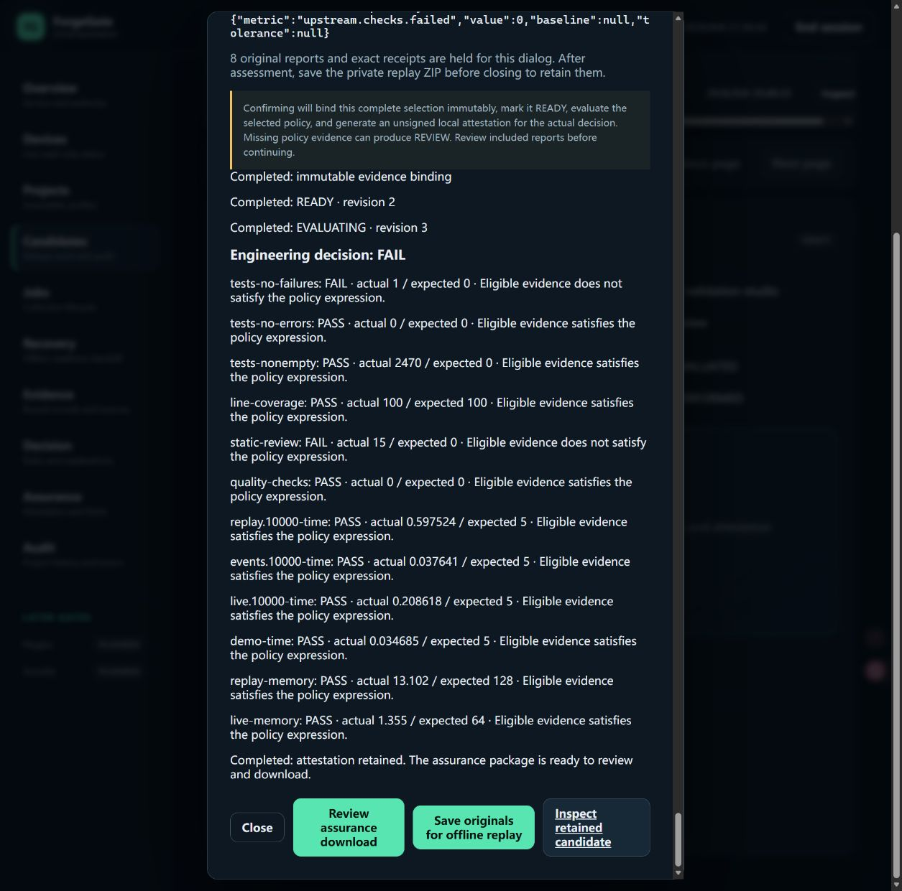

# ForgeGate

**Evidence in. Auditable release decision out.**

ForgeGate is a Windows-local release-assurance tool that turns existing test,
coverage, static-analysis and benchmark reports into a traceable policy decision
and a portable, independently verifiable handoff.

Built for individual developers and small engineering teams reviewing scattered
reports before a release. It automates report identification, normalization and
reviewed assessment; it does **not** run the upstream tests or replace a CI system.
Human time savings and accuracy improvement remain **not measured**.

[](https://github.com/Carlos-0798/forgegate/actions/workflows/ci.yml)

## Current status

**Completed Windows Local Alpha milestone — `0.1.0a1`, September 2026.**
The installable CLI, authenticated local Dashboard, real-report integration and
offline review workflow have accepted local evidence. This is a completed,
demonstrable engineering milestone, **not a production service or public release**.

The core workflow supports:

- **Quick assessment:** select 1–4 existing reports (one per supported family),
  inspect normalized evidence and warnings, select a compatible saved policy,
  then explicitly confirm the evidence-to-decision workflow.
- **Traceable decisions:** bind evidence to the candidate's declared commit and
  immutable project/policy context; explain PASS, FAIL, REVIEW or ERROR per rule.
- **Independent handoff:** export candidate-bound assurance and, separately,
  reviewed original-report replay bundles for database-independent verification.
- **Repeatable operations:** compare compatible candidate decisions; retain
  audited local report jobs, coordinated backups and reviewed recovery evidence.
- **Optional device status:** saved MSP430 UART v1 read-only presets and an
  explicitly simulated demonstration, kept separate from release evidence.

**CI disclosure:** current hosted jobs are blocked by GitHub's reported
billing/spending limit. The local figures below are not latest hosted-CI results;
the badge reflects GitHub workflow status, not overall product acceptance. See the
[synchronization record](reports/GITHUB_SYNC_2026-09-09.md).


This retained browser capture uses synthetic tutorial data. It demonstrates the
implemented workbench, not a customer deployment or a real project's passing tests.

## Architecture and workflow



**Stack:** Python 3.12, FastAPI, Pydantic, Typer, SQLite, TypeScript/native DOM,
Vite, JSON Schema, pytest and Ed25519-based local authentication.

Collectors accept JUnit, Cobertura/LCOV coverage, SARIF 2.1.0 and ForgeGate's
benchmark JSON contract. Optional Analog Validation Studio (AVS) and MSP430
collectors consume versioned artifacts without importing either upstream runtime.
Generic operation requires neither peer project nor a connected board.

The same-origin Dashboard exposes reviewed actions over a loopback-only API.
SQLite retains candidate history, exact policy material and audit records.
Live device status is a separate input-only path and never becomes release proof.
See the [product brief](docs/product/PRODUCT_BRIEF.md) and
[documentation index](docs/README.md).

## Verified outcomes

These are retained **local** acceptance results, not customer metrics. Earlier
reports keep their original dates and scopes; their test counts are not additive.

| Verification | Recorded outcome | Scope / evidence |
|---|---|---|
| Python regression | **1,568 passed; 3 skipped; 95.90% branch-aware combined coverage** | Host suite; Windows symlink-permission skips; [latest acceptance](reports/PHASE_64_MONITOR_PRESETS_ACCEPTANCE.md) |
| Frontend regression | **296 passed** | Production-TypeScript host tests, not 296 manual browser scenarios; [machine record](reports/PHASE_64_MONITOR_PRESETS_EVIDENCE.json) |
| Interaction and quality gates | **33/33 CLI/API checks**, typing, lint/format, assets and contract drift passed | Local development verification; [latest acceptance](reports/PHASE_64_MONITOR_PRESETS_ACCEPTANCE.md) |
| Windows delivery | Clean-install release smoke and installed-browser lifecycle checks passed | Isolated wheel installation; [final user path](reports/PHASE_63_FINAL_USER_PATH_ACCEPTANCE.md), [preset extension](reports/PHASE_64_MONITOR_PRESETS_ACCEPTANCE.md) |
| Real AVS report integration | **4 collections, 130 records, 12 rules: 10 PASS / 2 FAIL** | Retained software reports; independent replay **VALID / FAIL**, with no new upstream run; [acceptance](reports/PHASE_56_AVS_QUICK_ACCEPTANCE.md) |
| End-to-end browser handoff | Synthetic PASS/FAIL/REVIEW, private replay, assurance verification and policy-aware comparison accepted | Actual Windows browser runs with separately identified artifacts; [assessment](reports/PHASE_54_QUICK_ASSESSMENT_ACCEPTANCE.md), [installed workflow](reports/PHASE_58_WINDOWS_DELIVERY_ACCEPTANCE.md) |



**Integration PASS does not mean engineering decision PASS.** This real retained
AVS report set correctly keeps its two failing rules. Its original reports and
complete rule outcomes are reproducible; ForgeGate did not rerun the producer's
tests, authenticate their origin or verify physical hardware.

Additional scoped evidence—negative inputs, HTTP error presentation, keyboard,
zoom, backup/recovery, optional UART observation and Windows plugin isolation—is
indexed in the [verification matrix](docs/VERIFICATION_MATRIX.md) and
[evidence gallery](docs/PORTFOLIO_EVIDENCE.md). Coverage is a configured test-suite
metric, not an accuracy, security, accessibility or hardware certification.

## Key design decisions

- **Collection is not approval.** Parsing contributes evidence; policy evaluation
  and state-changing actions remain explicitly reviewed.
- **Integrity is not authenticity.** SHA-256 binds bytes and associations. A
  bundle signature authenticates its signer under a separate trust store, not
  the original report producer or a trusted timestamp.
- **History and authority are retained.** Append-only history, expected revisions
  and idempotency keys distinguish safe retries from conflicting writes. Each
  candidate retains its exact project profile and policy material.
- **Verification travels with the result.** Assurance checks need no source
  database; the separate private replay export retains original report bytes.
- **Local credentials stay off the page.** CLI approval creates a scoped browser
  session; private signing keys and raw API tokens are not entered into the UI.
- **Compatibility preserves evidence levels.** Domain-neutral contracts and
  optional adapters never promote simulated or software results to physical proof.

## Quick start

Windows and Python 3.12 are the tested target. Use the supplied private delivery
wheel in a short local directory; this repository does not advertise a public
package release. Dependencies require a package cache or package-index access.

If you have repository access but no supplied wheel, build one from your checkout:

```powershell
.\tools\setup_environment.ps1
.\.venv\Scripts\python.exe tools\build_windows_delivery.py .\work\private-delivery
```

The setup runs the local Python verification gate. Copy the resulting wheel to
a new short, private installation directory, then run the following commands
there. The builder refuses an existing output directory; use a new name on reruns.

```powershell
py -3.12 -m venv .venv
.\.venv\Scripts\python.exe -m pip install .\forgegate-0.1.0a1-py3-none-any.whl
.\.venv\Scripts\python.exe -m forgegate workspace-init .\my-workspace --demo
.\.venv\Scripts\python.exe -m forgegate dashboard `
  --database .\my-workspace\forgegate.db `
  --trust-store .\my-workspace\trust-store.json `
  --job-store .\my-workspace\jobs.db --existing-pair --port 8000
```

Keep that terminal running. Open `http://127.0.0.1:8000/app/` and select
**Start local activation**. In a second terminal, use the fresh code from the page:

```powershell
.\.venv\Scripts\python.exe -m forgegate dashboard-activate FG-ABCDE-FGHJK `
  --server http://127.0.0.1:8000 `
  --identity .\my-workspace\identity.json `
  --private-key .\my-workspace\operator-key.pem `
  --role operator --project sample-project
```

Review the synthetic PASS/FAIL candidates on Overview, then repeat Quick assessment
with the included original reports. An intended FAIL is a policy rejection, not
a software crash. CLI decision exits are `0` PASS, `1` FAIL, `2` REVIEW, `3` ERROR.

Initialization refuses an existing target; change the port in all three places
if occupied. The workspace contains an **unencrypted private key** and private
data: protect it with Windows account permissions and do not upload it. No
hardware is opened by this quickstart. Stop the server deliberately with `Ctrl+C`.

See the [complete first-use guide](docs/LOCAL_WORKSPACE_QUICKSTART.md) for expected
outputs, policy selection and export verification. For source development, run
`tools/setup_environment.ps1` from the checkout; it installs the constrained
development environment and runs `tools/verify.py`. Packaging acceptance is
`python tools/release_smoke.py` using the repository `.venv`.

## Repository layout

| Path | Purpose |
|---|---|
| [`src/forgegate/`](src/forgegate/) | Models, collectors, policy engine, stores, CLI/API, Dashboard and adapter boundaries |
| [`tests/`](tests/) | Unit, adversarial, integration, migration and contract tests |
| [`schemas/`](schemas/) | Versioned JSON Schema and OpenAPI contracts |
| [`examples/`](examples/) | Reproducible generic inputs and optional consumer packs |
| [`docs/`](docs/README.md) | Product decisions, operations, compatibility and evidence gallery |
| [`reports/`](reports/README.md) | Acceptance records and immutable historical phase evidence |
| [`tools/`](tools/) | Setup, verification, schema export and clean-install smoke |

## Known limitations

- Local single-user Windows Alpha only; no approved LAN/internet deployment,
  TLS/proxy identity, managed key lifecycle or production reliability claim.
- Report parsing is bounded. There is no arbitrary test-command execution,
  general web crawling, background scheduler or distributed job service.
- Original reports may be sensitive; review exports and save browser-held replay
  inputs before closing the assessment. Hashes do not establish producer identity.
- Optional MSP430 monitoring is read-only and process-local: no hardware control,
  sensor-accuracy validation or durable measurement capture. No second board has
  been physically verified; simulated presets do not expand verified board support.
- Plugin discovery and a fixed Windows Podman/WSL2 fixture have scoped evidence;
  general third-party publisher trust and native/dependency-rich compatibility do not.
- Spoken screen-reader output, Windows high contrast and real Remote Desktop
  acceptance remain open. Independent novice use and human efficiency are unmeasured.
- GitHub integration performs offline bundle/commit gating, not custom Checks,
  OIDC provenance, API publication or automatic deployment.

See [SECURITY.md](SECURITY.md) and the [threat model](docs/security/THREAT_MODEL.md)
for trust assumptions. Untested or planned capabilities are not delivered results.

## Roadmap

The accepted local milestone is preserved while portfolio synchronization is
completed. The [resume checkpoint](docs/PROJECT_RESUME_CHECKPOINT_2026-09-09.md)
records the exact pause point, remaining work and safe resumption sequence.

1. Resume extensibility with a bounded protocol-adapter conformance example;
   require actual device acceptance before claiming another supported board.
2. Complete independent first-use and the deferred, matched human comparison
   before claiming measured usability, speed or accuracy improvement.
3. Close the outstanding native assistive-technology checks with retained results.
4. Add a new upstream report revision or another adapter only for a concrete
   owner-selected workflow; preserve historical failures and evidence boundaries.

Managed runtime adoption, cloud/team services and broader plugin provenance remain
separate future objectives, not prerequisites for the accepted report workflow.
See the [detailed roadmap](docs/ROADMAP.md) for completed and deferred work.

## License status

No open-source license has been selected. This private-development repository is
all rights reserved. A GitHub synchronization does not authorize public visibility,
redistribution, a public release, a License change or LinkedIn publication.
