# Portfolio evidence gallery

This page provides a short review path followed by the retained screenshot and
acceptance archive. The captures distinguish three kinds of evidence:
synthetic workflow tests, integration with retained real Analog Validation Studio
(AVS) software reports, and a historical owner-authorized, input-only observation
of a physically connected MSP430 UART. A real browser capture does not make its
input data real, and a real UART observation does not validate sensor accuracy.
These artifacts do not demonstrate a production deployment or customer use.

## Recommended review path

| Review question | Artifact and acceptance record | What it supports |
|---|---|---|
| Can a user inspect a version and understand a failed rule? | [Workbench](assets/phase62/workbench.jpg), [failed-rule view](assets/phase62/decision-fail.jpg), [workbench acceptance](../reports/PHASE_62_WORKBENCH_ACCEPTANCE.md) | Implemented Windows Dashboard workflow using explicitly synthetic inputs |
| Does it work with another project's actual reports? | [Real AVS decision](../reports/phase56-browser/avs-quick-decision.png), [real-report acceptance](../reports/PHASE_56_AVS_QUICK_ACCEPTANCE.md) | Retained software reports preserve the original engineering FAIL and its rule outcomes; no upstream rerun or hardware verification |
| Can another person check the exported result? | [Reviewed export](assets/forgegate-dashboard-assurance-export-confirm.jpg), [portable export acceptance](../reports/PHASE_28_DASHBOARD_ASSURANCE_EXPORT_ACCEPTANCE_REPORT.md), [original-report replay acceptance](../reports/PHASE_51_SOURCE_REPLAY_ACCEPTANCE.md) | Candidate-bound assurance verification and the separate original-report replay path; integrity is not producer authenticity |
| What is the optional hardware boundary? | [MSP430 status view](assets/forgegate-dashboard-msp430-decoded-faults.jpg), [observation record](../reports/PHASE_25_MSP430_LIVE_STATUS_EVIDENCE_2026-09-05.json) | Historical read-only transport, heartbeat and firmware-reported fault presentation; no device control or calibrated measurement claim |

To try the current product, follow the
[independent local workspace guide](LOCAL_WORKSPACE_QUICKSTART.md). The archive
below retains each checkpoint's original input, date and scope; older interface
captures and then-paused synchronization notes are historical, not the current
product or repository state. No screenshot has been regenerated for this index.

## Evidence boundary

The [Phase 62 workbench acceptance](../reports/PHASE_62_WORKBENCH_ACCEPTANCE.md)
adds six actual in-app-browser captures from a new installed-wheel workspace.
Two candidates were seeded explicitly as synthetic and two were created and
assessed through the UI. Downloaded positive/negative assurance independently
verifies VALID/PASS and VALID/FAIL. These captures supersede the earlier Overview
appearance, without invalidating historical workflow evidence.

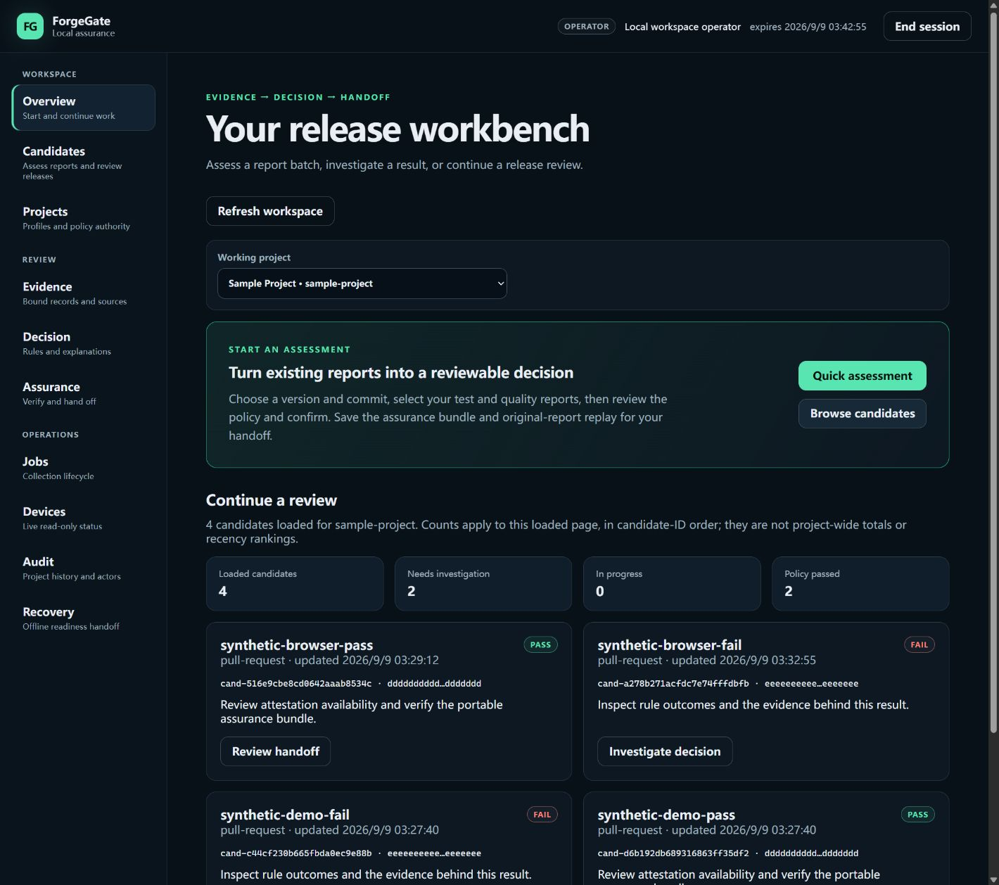

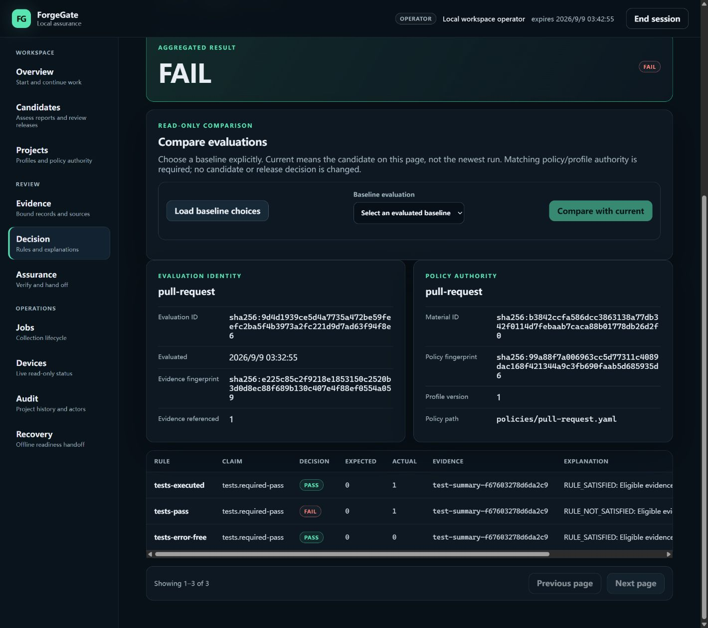

The [Phase 61 final demo](../reports/PHASE_61_FINAL_DEMO_ACCEPTANCE.md) reuses six
Phase 58 installed-wheel captures because Phase 59 proved all 109 runtime members
byte-equal. It also records a fresh authenticated browser walkthrough; no duplicate
image is represented as newly captured evidence.

The [Phase 56 real AVS quick assessment](../reports/PHASE_56_AVS_QUICK_ACCEPTANCE.md)
adds actual Edge screenshots and independent downloaded-replay comparison with
the retained real host baseline. All 12 rules preserve the engineering FAIL.
This is a new ForgeGate interaction test, not a new AVS test execution.

The [Phase 55 quick-handoff acceptance](../reports/PHASE_55_QUICK_HANDOFF_ACCEPTANCE.md)
retains current Windows Edge screenshots of a completed synthetic assessment and
its reviewed original-file replay download, with hashes and independent VALID /
PASS readback. It demonstrates saved-policy reuse and no repeat report selection,
not a measured human speedup. Those captures use an isolated fixture workspace.

The [Phase 29 project Audit report](../reports/PHASE_29_PROJECT_AUDIT_ACCEPTANCE.md)
adds a separate generic 28-event fixture and exact screenshot hashes. Its
operator page does not imply authenticated actors for historical CLI records.

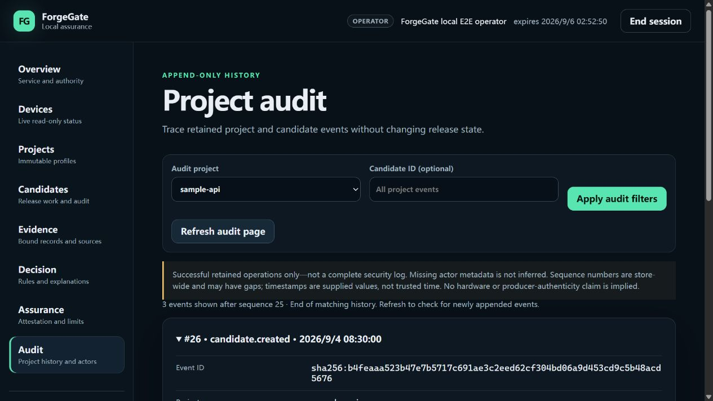

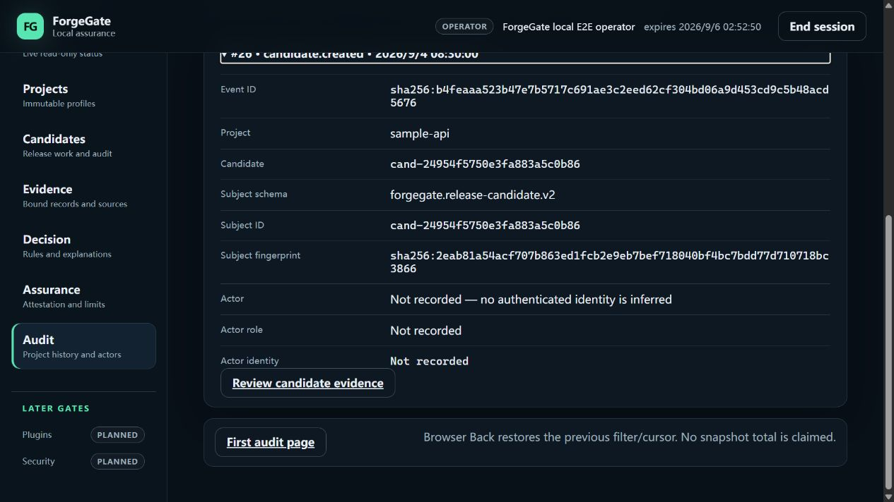

- Environment: Microsoft Edge, Google Chrome, and Codex in-app browser on
  Windows, loopback-only ForgeGate Dashboard
- Evidence level: `LOCAL_BROWSER_TEST`
- Product status at capture time: private Windows Alpha `0.1.0a1`
- Hardware access: candidate-workflow captures `NOT_PERFORMED`; Devices capture
  `READ_ONLY_TELEMETRY`
- Remote deployment and release approval: not demonstrated
- Source checkpoint: the Phase 24 captures use `ed205c7`; Phase 26 capture
  identities are retained in their machine-readable record

The exact fixture values, output cross-checks, image dimensions, and SHA-256
digests are retained in the
[Dashboard capture record](../reports/DASHBOARD_PORTFOLIO_CAPTURE_EVIDENCE_2026-09-04.json),
the [Phase 26 assurance-review record](../reports/DASHBOARD_ASSURANCE_REVIEW_EVIDENCE_2026-09-05.json),
the [Phase 27 interaction record](../reports/DASHBOARD_PHASE27_INTERACTION_EVIDENCE_2026-09-05.json),
the [Phase 28 assurance-export record](../reports/DASHBOARD_PHASE28_ASSURANCE_EXPORT_EVIDENCE_2026-09-05.json),
the [Phase 37 job-result handoff record](../reports/PHASE_37_JOB_RESULT_HANDOFF_EVIDENCE.json),
the [Phase 45 recovery receipt review record](../reports/PHASE_45_RECOVERY_REHEARSAL_REVIEW_EVIDENCE.json),
the [MSP430 live-status record](../reports/PHASE_25_MSP430_LIVE_STATUS_EVIDENCE_2026-09-05.json),
and the [owner-assisted unplug/replug follow-up](../reports/MSP430_MANUAL_UNPLUG_REPLUG_EVIDENCE_2026-09-05.json).

## Restored-copy receipt review

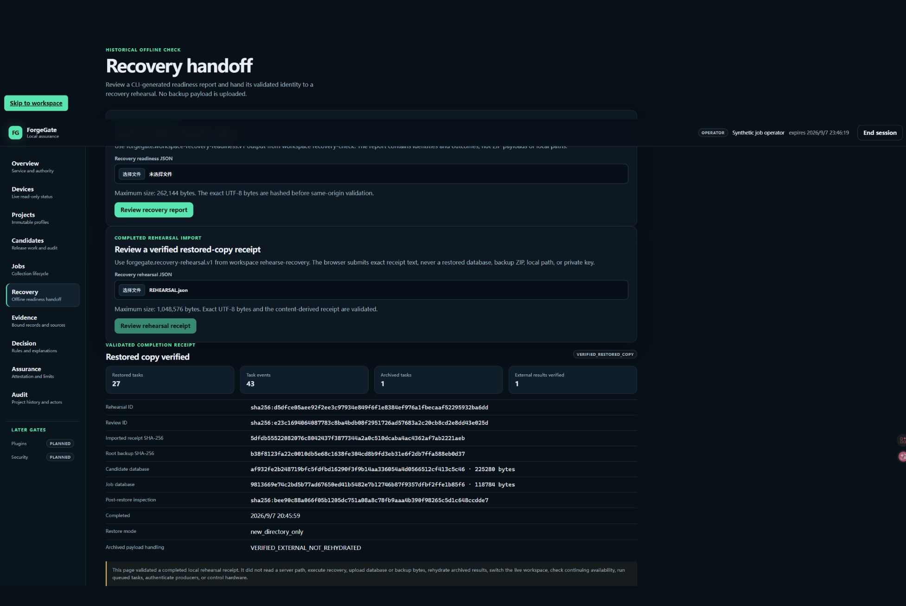

This isolated Edge capture uses the actual synthetic Phase 44 completion receipt.
It shows 27 restored tasks, 43 events, one archived task and one verified external
result, together with content-derived receipt/review identities and exact database
hashes. It demonstrates read-only receipt presentation, not a restore execution,
live-workspace switch, continuing-availability check, producer authentication,
hardware operation or production acceptance.

## 1. Authority and limitations

### Activation reliability follow-up

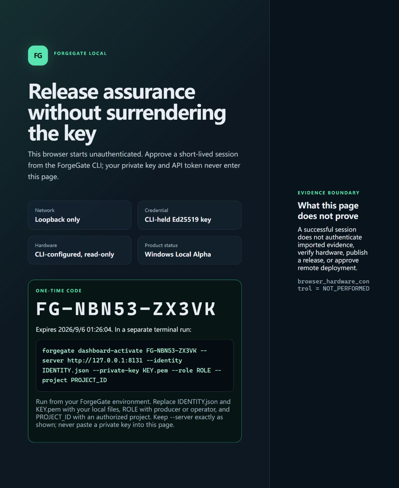

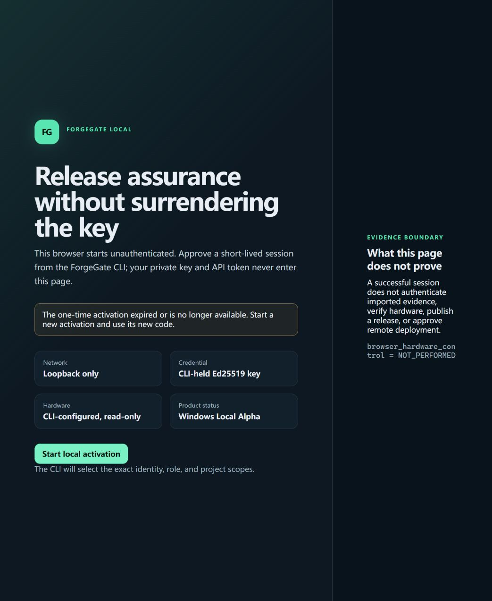

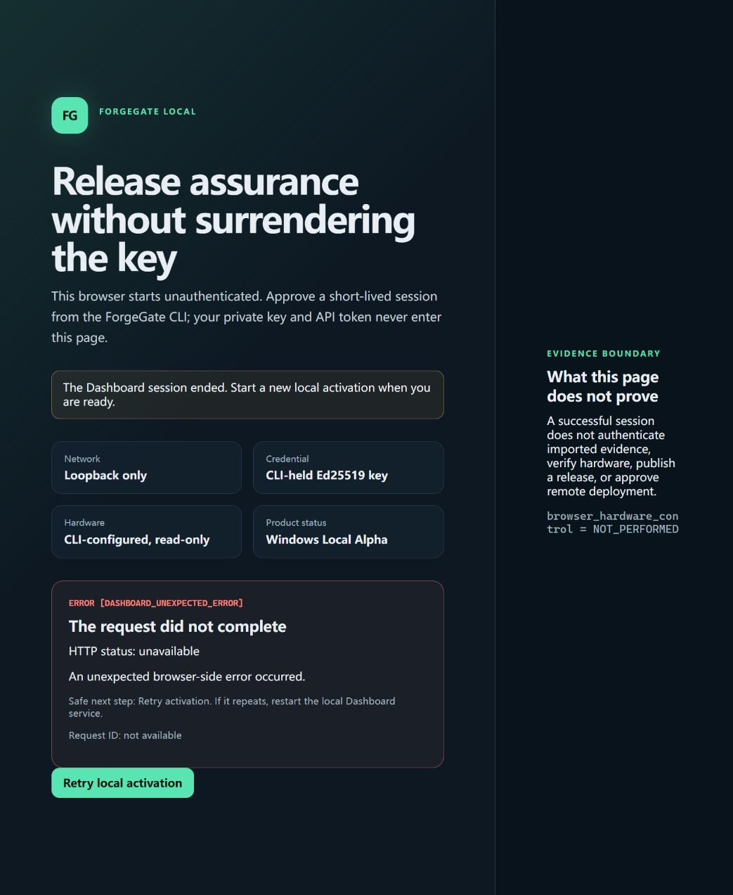

These unedited in-app-browser captures demonstrate origin-aware CLI approval
and actual code-expiry recovery. The depicted code was consumed and the session
ended; no private key, API token, or cookie is shown. Exact hashes, expected and
actual behavior, host-test boundaries, and the GitHub CI account restriction
are retained in the [activation follow-up report](../reports/DASHBOARD_ACTIVATION_RECOVERY_2026-09-06.md).

### Authenticated overview

This view demonstrates the authenticated local shell, service/schema status,
project scope, and the visible distinction between request success and a
release decision. The identity and trust-store fingerprints belong to a
deterministic generic test identity; no secret key material is shown.

## 2. Candidate workspace

The retained fixture contains one `sample-api` candidate:

- version `portfolio-alpha-1.0.0`;
- commit `7777777777777777777777777777777777777777`;
- branch `portfolio/readme-evidence`;
- track `pull-request`; and
- state `DRAFT`, revision `0`.

The page explicitly says that collection and evaluation are later actions.

## 3. Candidate state and append-only audit

The detail view exposes the authoritative candidate ID, exact commit, frozen
project profile version, engineering-decision state, hardware boundary, and
the matching `candidate.created` audit event. A `DRAFT` is not presented as a
passing release decision.

## 4. Bound evidence review

This generic completed fixture contains one retained `test.summary` record. The
page displays its exact `{ "failures": 0 }` value, `claimed_ci_metadata` trust,
`ci_validated` verification label, and referenced artifact hash. It does not
claim that the browser re-ran the collector or authenticated the producer.

## 5. Explainable policy decision

The selected rule expected `0`, observed `0`, referenced
`test-summary-12345678`, and returned `RULE_SATISFIED` / `PASS`. The policy
material ID and fingerprint remain visible beside the evaluation identity.

## 6. Attestation and portable assurance identity

The page exposes the exact attestation ID, bundle ID, transition chain,
`unsigned_local` assurance level, retained-document verification scope, and
`source artifact bytes = not_embedded`. These labels prevent a local review from
being presented as deployment approval or hardware validation.

## 7. Strict validation and recovery

The browser submitted a deliberately invalid track, `INVALID!`, with generic
version, commit, and branch values. The server returned HTTP 422 with
`API_REQUEST_VALIDATION_FAILED`, a safe recovery instruction, and a request ID.
An independent CLI read immediately afterward found the same one candidate and
the same two audit events (`project.registered` and `candidate.created`), so the
rejected request did not create a durable candidate or audit event.

## 8. Pagination acceptance

This earlier Chrome capture comes from the separate generic 129-record
acceptance fixture. All six pages were traversed as
`25/25/25/25/25/4`, producing 129 unique versions with no duplicates. The
complete input/output record and remaining acceptance boundary are in the
[Phase 24 actual-browser interaction report](../reports/PHASE_24_MANUAL_INTERACTION_ACCEPTANCE_2026-09-04.md).

## 9. Read-only MSP430 live status

This Windows browser capture shows the selected COM4 application UART as
`CONNECTED`, its valid-frame heartbeat as `NORMAL`, and the firmware-reported
health independently as `FAULT 0015`. The page decodes the versioned protocol
bits as DS18B20 missing, NTC unavailable/range, and INA219 communication while
explicitly identifying them as firmware reports. The monitor performed
input-only reads;
it did not send a serial command or modify firmware, debug state, GPIO, FRAM, or
an external load. The capture supports live transport and page-presentation
claims only. It does not validate sensor values, firmware correctness, release
evidence, or long-duration stability.

## 10. Reviewed candidate workflow

The Phase 27 Edge run created one generic `sample-api` candidate, separately
reviewed every lifecycle transition, bound an exact evidence assembly,
evaluated frozen policy material, and generated an immutable unsigned-local
attestation. The candidate table and detail were reloaded from authoritative
state and both displayed PASS revision 4.

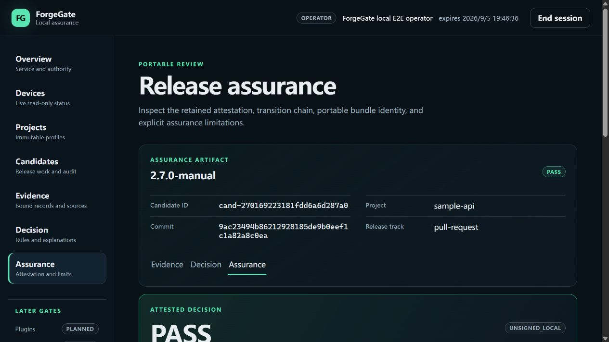

These images support implemented interaction and traceability claims. They do
not authenticate the generic evidence producer, publish a release, approve
deployment, or validate hardware.

## 11. Exact Edge zoom

The same candidate workspace was checked with native Edge zoom at 100%, 125%,
150%, 175%, and 200%. The machine record retains six JPEG hashes, including the
200% reviewed-command dialog. Root horizontal overflow stayed zero and the
required action, limitations, focus loop, and Escape return remained reachable.
Only the 200% dialog image is highlighted here; the remaining zoom images are
retained for audit rather than crowding the landing page.

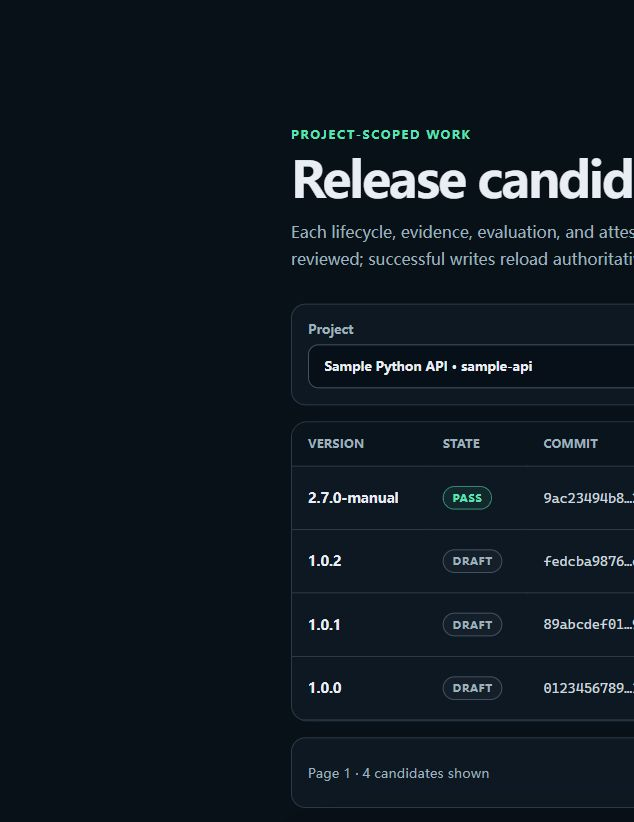

## 12. Candidate-bound portable download

The Phase 28 Edge run required an operator to review the current candidate
revision, content-derived bundle ID, exact three-file archive contract,
`unsigned_local` assurance, and `not_embedded` source-byte state before starting
the download.

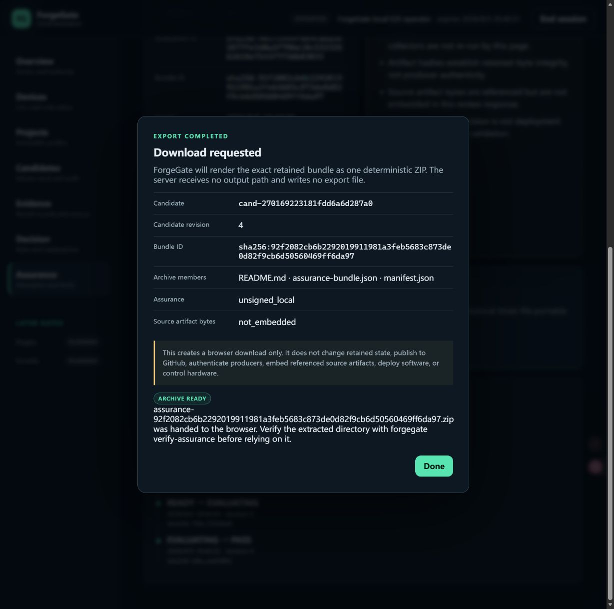

The downloaded 15,448-byte ZIP extracted to exactly `README.md`,
`assurance-bundle.json`, and `manifest.json`; the existing database-independent
verifier returned `VALID`. The browser action created no server file, candidate
mutation, release-audit event, remote publication, or hardware access.

## What these artifacts support

### Phase 30 bounded JUnit browser acceptance

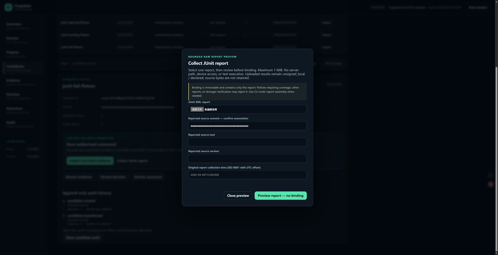

This unedited Edge viewport shows the new form against a separate synthetic
fixture database. Required-file validation, Escape and focus return were also
checked. This original capture remains form-only evidence; the follow-up below
completed actual file uploads and independent reviewed decisions.

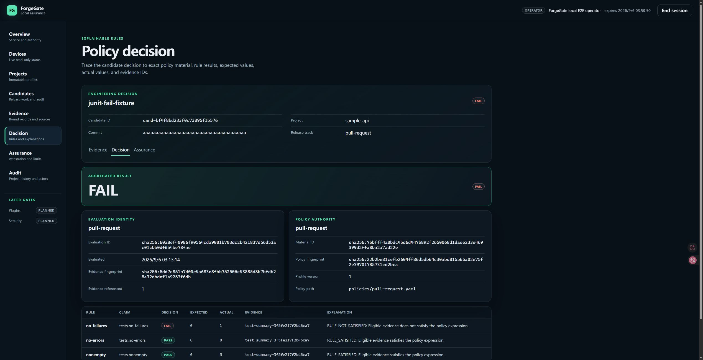

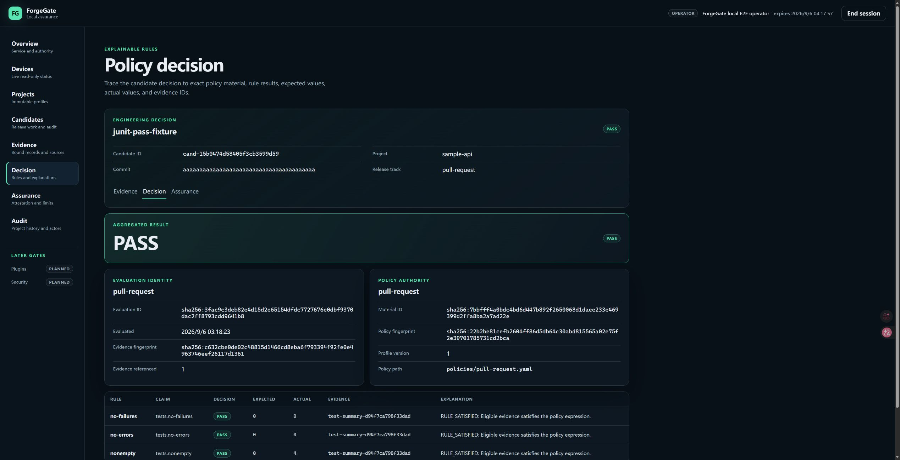

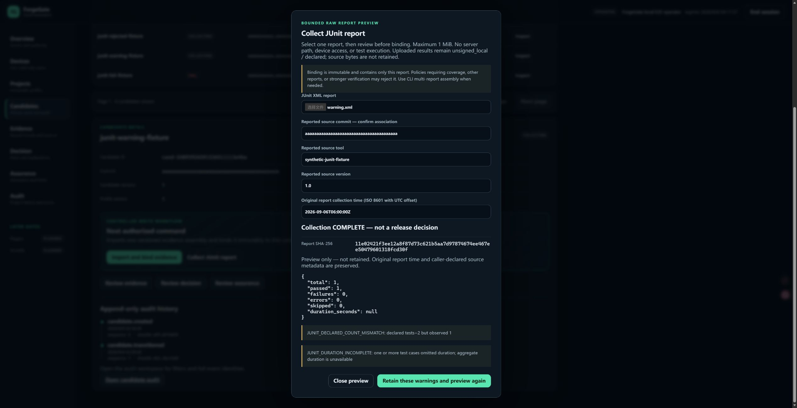

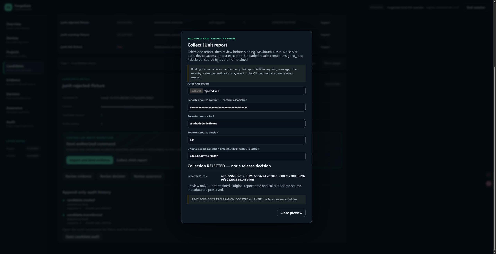

These unedited Edge captures use only the committed synthetic examples, not
upstream test results or physical measurements. The PASS is specific to the
fixture policy, which intentionally accepts declared evidence; it is not a
ForgeGate release approval. The [original shared-policy failure](assets/forgegate-dashboard-shared-policy-error.jpg)
and its schema-v9 correction are retained with exact hashes and expected/actual
results in the [Phase 30 report](../reports/PHASE_30_JUNIT_COLLECTION_ACCEPTANCE.md).

### Phase 31 Windows runtime evidence

This phase changes CLI/Windows operation support, not the browser UI. Retained
evidence is an [actual HTTP JSON receipt](../reports/PHASE_31_RUNTIME_HTTP_RECEIPT.json)
and [startup/recovery acceptance report](../reports/PHASE_31_WINDOWS_RUNTIME_ACCEPTANCE.md),
not a reused screenshot presented as a new page. The receipt SHA-256 is
`52fdf80f90374cc8f747a9f5458b12f04e0865fbf73cef58555016ae06c63715`
(UTF-8/LF text, matching the committed bytes).
It shows a temporary Dashboard returning 200/200, an API-only fixture returning
200/404, and refused connections after owned fixtures stop. These are local
software tests, not uptime, browser-interaction or hardware evidence.

### Phase 32 local data-protection evidence

[Backup acceptance](../reports/PHASE_32_STORE_BACKUP_ACCEPTANCE.md) records exact
synthetic snapshot counts/hash, WAL transaction isolation and cold application
readback. No database or raw project data belongs in this gallery. This checkpoint
has no browser-layout change and no new screenshot claim. At that historical
checkpoint, synchronization was paused and the results were retained locally
for later review; this does not describe the current repository state.

### Phase 33 combined-report evidence

[Acceptance and failure correction](../reports/PHASE_33_MULTI_REPORT_ACCEPTANCE.md)
records synthetic JUnit + Cobertura selection, immutable binding and policy PASS.
Screenshots retain exact report hashes, seven records, two collector receipts,
and a 50% expected/actual synthetic coverage rule. These are not repository
coverage metrics, upstream AFE/MSP results, provenance authentication or hardware.
The initial browser 422 was reproduced and fixed by exact JSON preservation.
At that historical checkpoint, evidence remained local while GitHub
synchronization was paused; the original acceptance scope is unchanged.

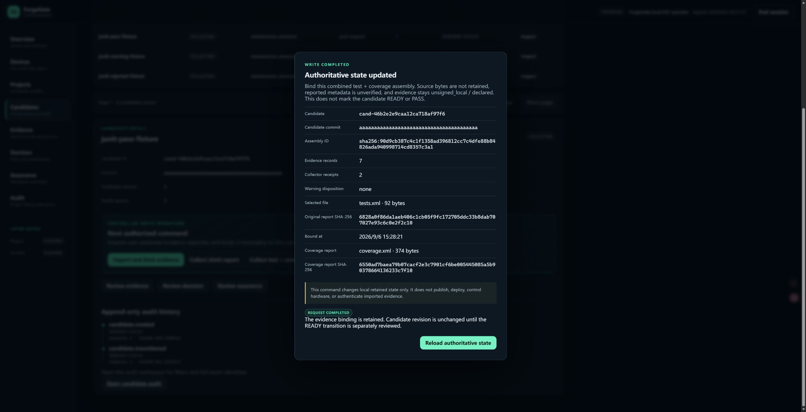

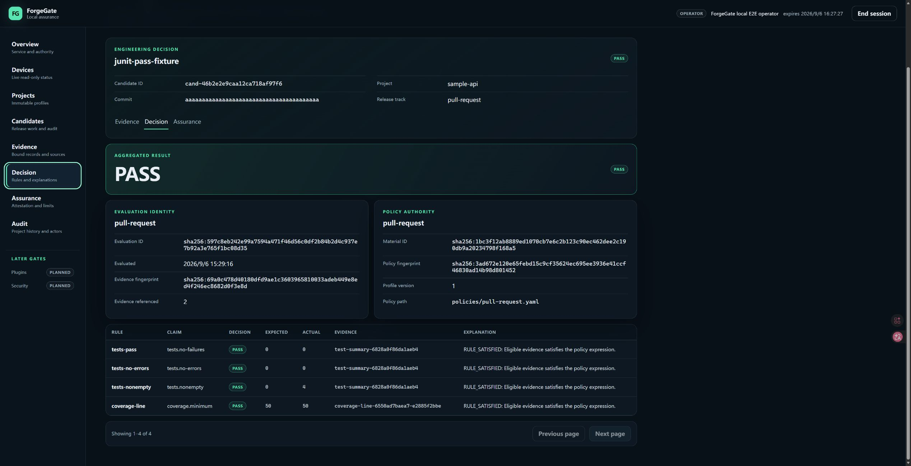

### Phase 37 retained-result handoff

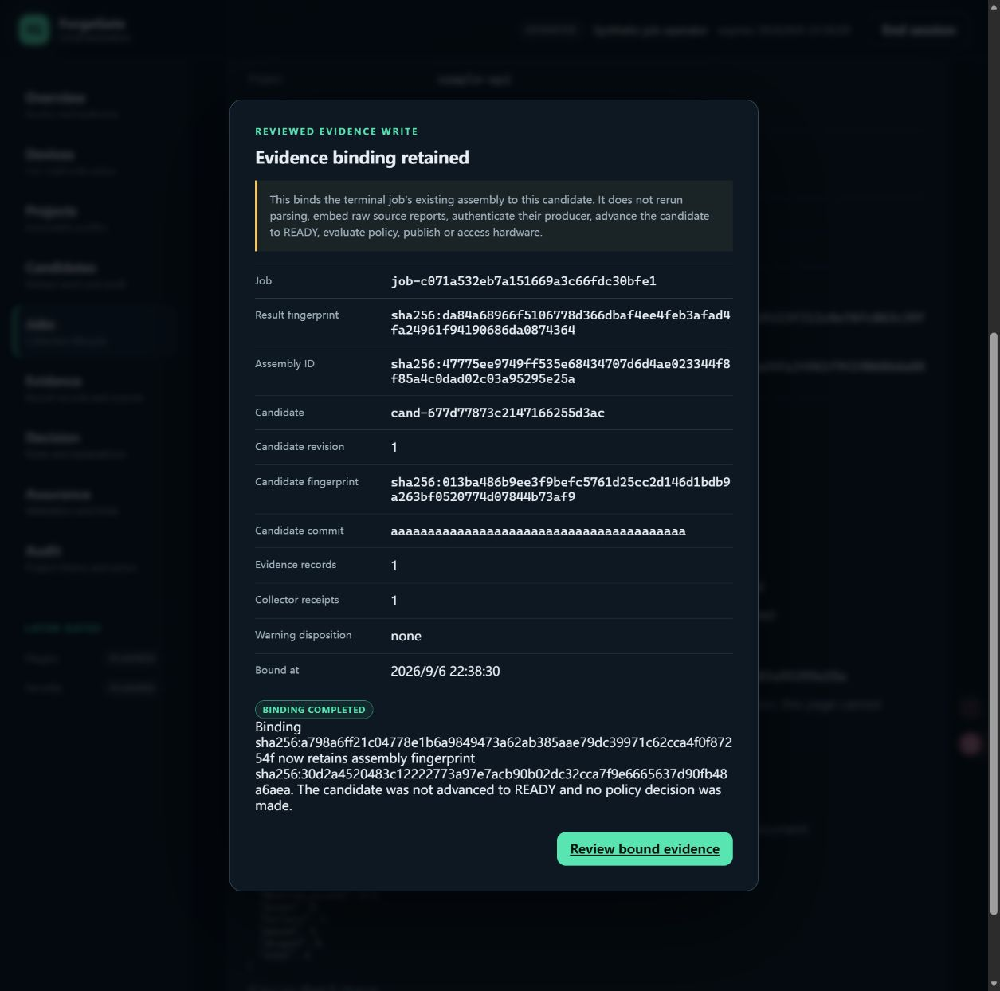

The isolated Edge fixture deliberately retained a four-test summary with one
failure. The browser downloaded and independently hashed the 2,010-byte canonical
assembly, then bound the same content through a separate confirmation. CLI/store
readback matched the assembly and binding identities while the candidate remained
`COLLECTING` revision 1. The images support local interaction, exact-byte and
immutable-binding claims only; they do not authenticate the synthetic producer,
turn the failed summary into PASS, access hardware or approve production use.

### Previously accepted browser workflow boundaries

They support the narrow claim that the authenticated, loopback-only Dashboard
implements activation, Overview, Devices, Projects, candidate list/create/
detail/audit, reviewed lifecycle/evidence/evaluation/attestation writes, and
candidate-bound Evidence/Decision/Assurance review,
operator-reviewed portable assurance download,
including visible evidence boundaries and actionable validation errors, on the
tested Windows browser setup. The Devices capture also supports an
owner-authorized, input-only MSP430 UART status observation.

They do not support claims of sensor or hardware-behavior validation, evidence authenticity,
production readiness, public release, non-loopback security, full
accessibility conformance, automatic browser-side collection, remote artifact publication, or
completion of the planned Plugins and Security pages.
