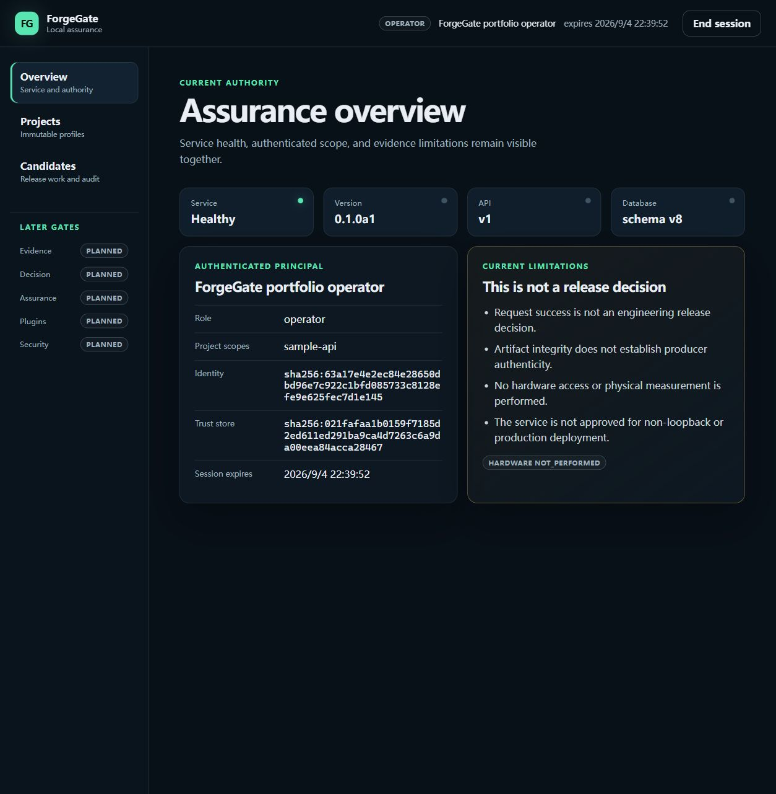
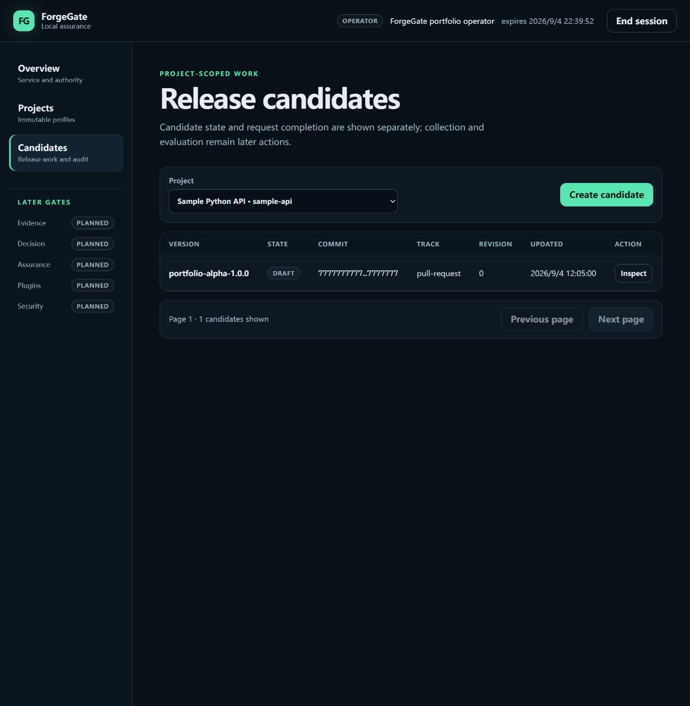
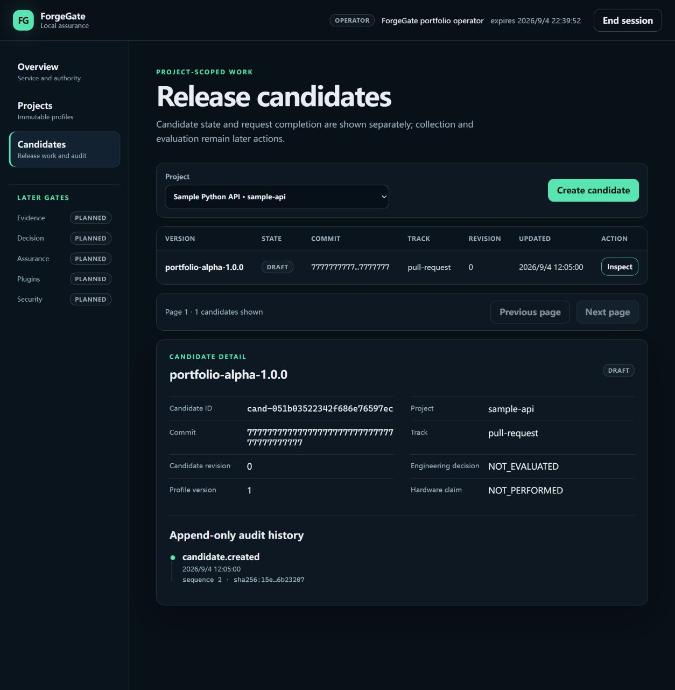
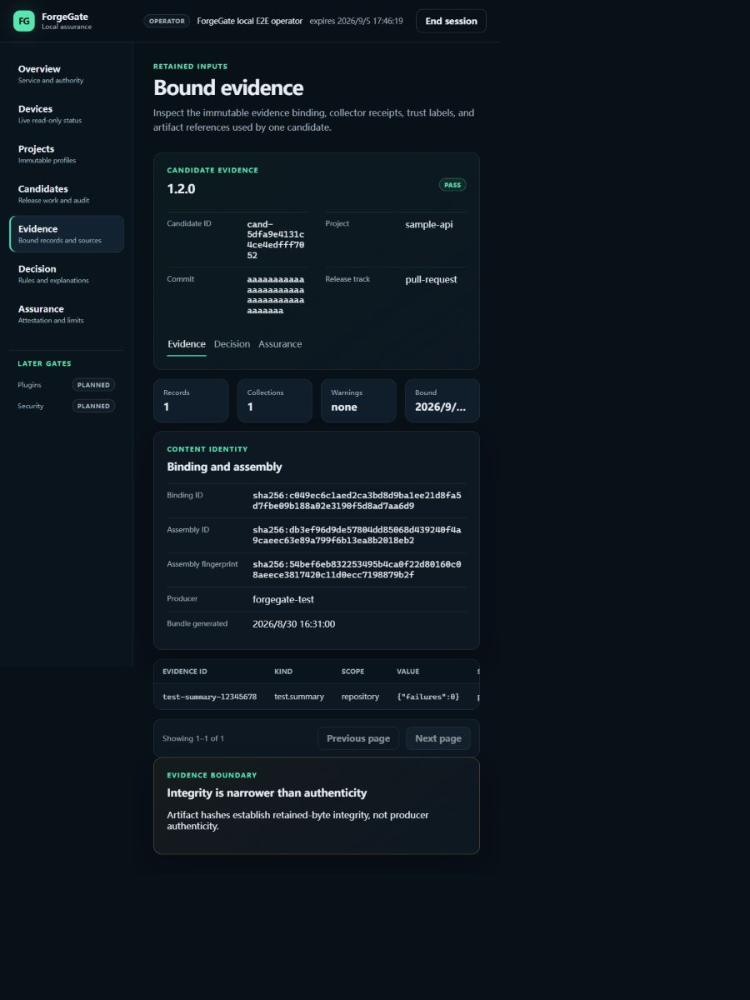
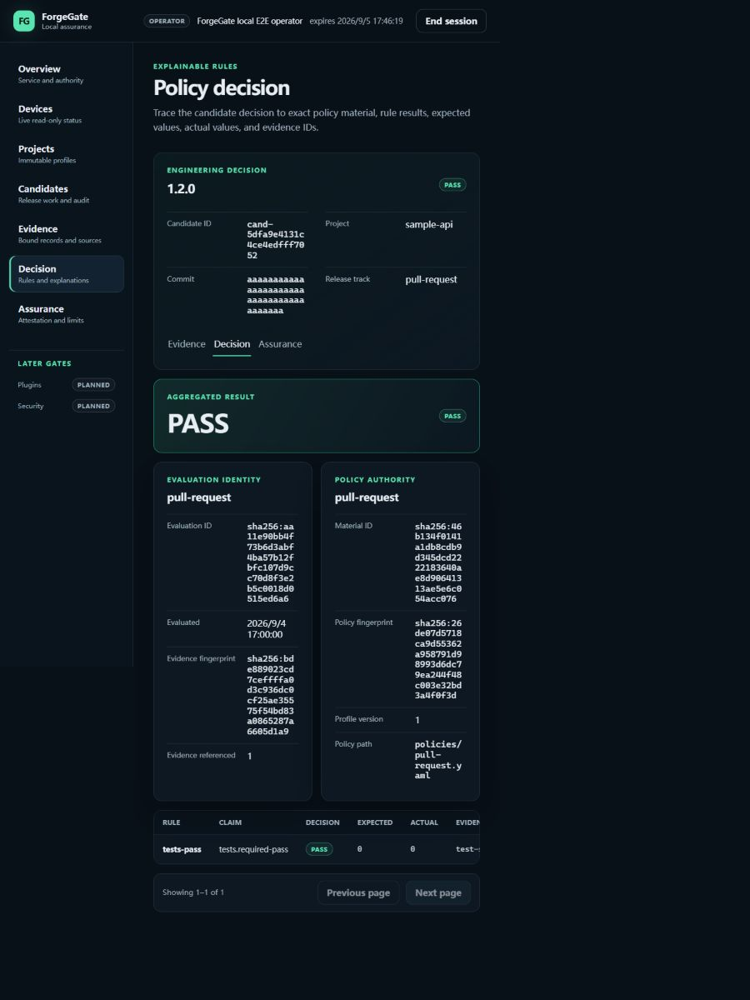
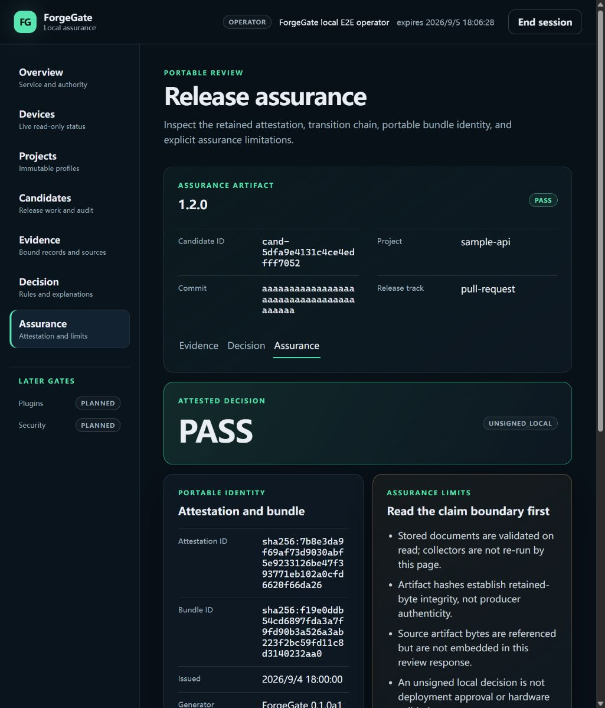
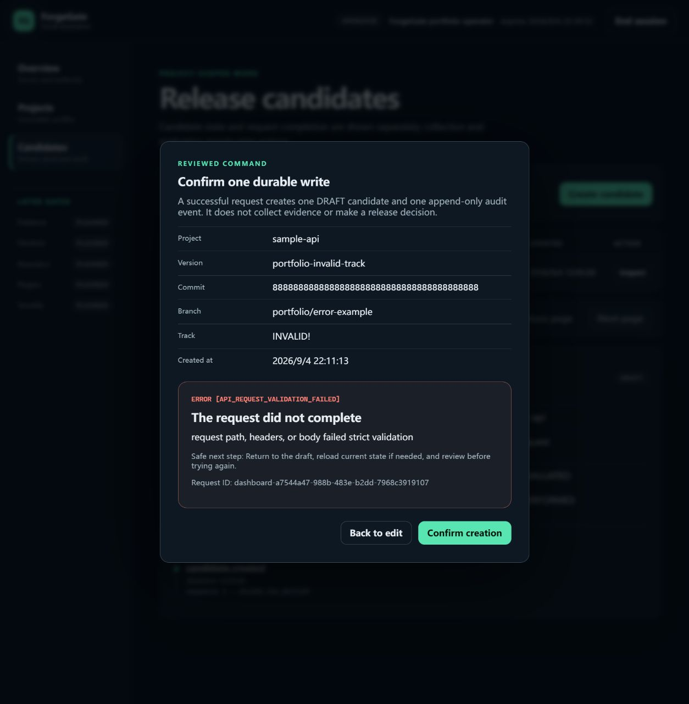
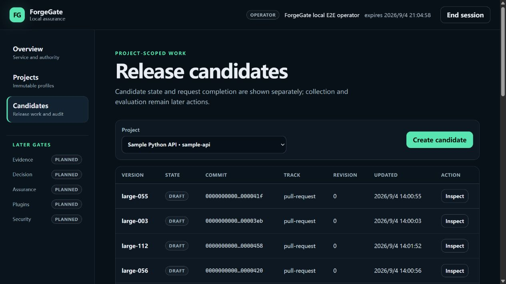

# Portfolio evidence gallery

This page collects the small set of real, reproducible artifacts intended for
the repository landing page and portfolio review. The candidate workflow images
use generic local fixture data. The final Devices image is separately labeled as
an owner-authorized, input-only MSP430 UART observation. None of the captures
contains a private key, API token, personal email address, validated physical
measurement, or production environment.

## Evidence boundary

- Environment: Google Chrome and Codex in-app browser on Windows, loopback-only
  ForgeGate Dashboard
- Evidence level: `LOCAL_BROWSER_TEST`
- Product status: private Windows Alpha `0.1.0a1`
- Hardware access: candidate-workflow captures `NOT_PERFORMED`; Devices capture
  `READ_ONLY_TELEMETRY`
- Remote deployment and release approval: not demonstrated
- Source checkpoint: the Phase 24 captures use `ed205c7`; Phase 26 capture
  identities are retained in their machine-readable record

The exact fixture values, output cross-checks, image dimensions, and SHA-256
digests are retained in the
[Dashboard capture record](../reports/DASHBOARD_PORTFOLIO_CAPTURE_EVIDENCE_2026-09-04.json),
the [Phase 26 assurance-review record](../reports/DASHBOARD_ASSURANCE_REVIEW_EVIDENCE_2026-09-05.json),
the [MSP430 live-status record](../reports/PHASE_25_MSP430_LIVE_STATUS_EVIDENCE_2026-09-05.json),
and the [owner-assisted unplug/replug follow-up](../reports/MSP430_MANUAL_UNPLUG_REPLUG_EVIDENCE_2026-09-05.json).

## 1. Authority and limitations

This view demonstrates the authenticated local shell, service/schema status,
project scope, and the visible distinction between request success and a
release decision. The identity and trust-store fingerprints belong to a
deterministic generic test identity; no secret key material is shown.

## 2. Candidate workspace

The retained fixture contains one `sample-api` candidate:

- version `portfolio-alpha-1.0.0`;
- commit `7777777777777777777777777777777777777777`;
- branch `portfolio/readme-evidence`;
- track `pull-request`; and
- state `DRAFT`, revision `0`.

The page explicitly says that collection and evaluation are later actions.

## 3. Candidate state and append-only audit

The detail view exposes the authoritative candidate ID, exact commit, frozen
project profile version, engineering-decision state, hardware boundary, and
the matching `candidate.created` audit event. A `DRAFT` is not presented as a
passing release decision.

## 4. Bound evidence review

This generic completed fixture contains one retained `test.summary` record. The
page displays its exact `{ "failures": 0 }` value, `claimed_ci_metadata` trust,
`ci_validated` verification label, and referenced artifact hash. It does not
claim that the browser re-ran the collector or authenticated the producer.

## 5. Explainable policy decision

The selected rule expected `0`, observed `0`, referenced
`test-summary-12345678`, and returned `RULE_SATISFIED` / `PASS`. The policy
material ID and fingerprint remain visible beside the evaluation identity.

## 6. Attestation and portable assurance identity

The page exposes the exact attestation ID, bundle ID, transition chain,
`unsigned_local` assurance level, retained-document verification scope, and
`source artifact bytes = not_embedded`. These labels prevent a local review from
being presented as deployment approval or hardware validation.

## 7. Strict validation and recovery

The browser submitted a deliberately invalid track, `INVALID!`, with generic
version, commit, and branch values. The server returned HTTP 422 with
`API_REQUEST_VALIDATION_FAILED`, a safe recovery instruction, and a request ID.
An independent CLI read immediately afterward found the same one candidate and
the same two audit events (`project.registered` and `candidate.created`), so the
rejected request did not create a durable candidate or audit event.

## 8. Pagination acceptance

This earlier Chrome capture comes from the separate generic 129-record
acceptance fixture. All six pages were traversed as
`25/25/25/25/25/4`, producing 129 unique versions with no duplicates. The
complete input/output record and remaining manual boundary are in the
[Phase 24 manual interaction report](../reports/PHASE_24_MANUAL_INTERACTION_ACCEPTANCE_2026-09-04.md).

## 9. Read-only MSP430 live status

This Windows browser capture shows the selected COM4 application UART as
`CONNECTED`, its valid-frame heartbeat as `NORMAL`, and the firmware-reported
health independently as `FAULT 0015`. The page decodes the versioned protocol
bits as DS18B20 missing, NTC unavailable/range, and INA219 communication while
explicitly identifying them as firmware reports. The monitor performed
input-only reads;
it did not send a serial command or modify firmware, debug state, GPIO, FRAM, or
an external load. The capture supports live transport and page-presentation
claims only. It does not validate sensor values, firmware correctness, release
evidence, or long-duration stability.

## What these artifacts support

They support the narrow claim that the authenticated, loopback-only Dashboard
implements activation, Overview, Devices, Projects, candidate list/create/
detail/audit, and candidate-bound Evidence/Decision/Assurance review,
including visible evidence boundaries and actionable validation errors, on the
tested Windows browser setup. The Devices capture also supports an
owner-authorized, input-only MSP430 UART status observation.

They do not support claims of sensor or hardware-behavior validation, evidence authenticity,
production readiness, public release, non-loopback security, full
accessibility conformance, browser-side collection/evaluation/export, or
completion of the planned Plugins and Security pages.
