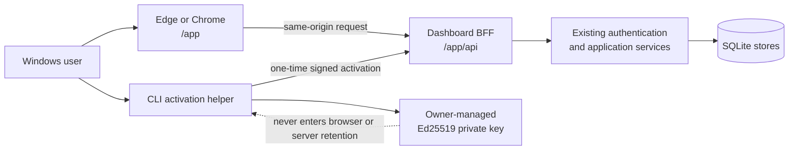

# Local Web Dashboard architecture

## Decision status

The local Dashboard architecture is accepted for implementation planning but is
not implemented. The current `0.1.0a1` product surfaces remain the CLI and the
authenticated loopback REST API. `/docs` and `/redoc` remain deliberately
disabled.

## Decision

ForgeGate will use a local same-origin web control plane served by the same
Python process as the existing FastAPI application. The installed product has
no Node.js runtime requirement and loads no runtime asset from a CDN. A build
toolchain may produce versioned static assets during development; the built
assets must be included in and verified from the wheel.

The proposed production routes are:

| Route | Purpose |
|---|---|
| `/app/` | Hashed static Dashboard assets and browser routes |
| `/app/api/` | Cookie-authenticated browser-for-frontend boundary |
| `/v1/` | Existing Bearer-authenticated public local API |
| `/healthz` | Existing health contract |
| `/openapi.json` | Existing committed and drift-checked machine contract |
| `/docs`, `/redoc` | Continue to return 404 |

The browser-for-frontend boundary is intentionally separate from `/v1/`: raw
Bearer tokens must not be exposed to browser JavaScript, while current CLI and
API clients retain the existing challenge/session protocol.

## Component boundary

The UI owns draft form state and presentation only. The application service
owns commands and queries. Domain models own lifecycle, evidence, policy,
identity, and assurance invariants. SQLite remains the authoritative durable
state.

## Local activation design gate

Phase 24 must implement and validate a companion activation flow before any
protected Dashboard data is rendered:

1. The browser creates a bounded, one-time activation request at `/app/api/`.
2. The page displays a short non-secret activation code, requested identity,
   role, project scopes, and expiry.
3. A separate CLI command loads the owner-selected key, signs the exact
   challenge, and submits the result over loopback.
4. The BFF validates the signature and trust record through the existing
   authenticator and binds the approved principal to the requesting browser.
5. The browser receives only an opaque, host-only, HttpOnly, SameSite=Strict,
   short-lived Dashboard cookie. No Bearer token or private key is returned to
   JavaScript or placed in a URL.
6. Logout, expiry, revocation, trust reload, process restart, or scope mismatch
   invalidates the BFF session and clears protected UI state.

Cookie authentication adds CSRF concerns. Every state-changing `/app/api/`
request must pass exact Host and Origin checks plus a per-session anti-CSRF
value. The direct `/v1/` API continues to require its Bearer token and does not
accept the Dashboard cookie.

This design does not establish protection from a hostile local administrator or
malware running as the same user. The Dashboard remains loopback-only and not
approved for non-loopback deployment.

## Frontend constraints

- Use strict TypeScript and one explicit state/query layer; choose the component
  framework only after a locked dependency and license preflight.
- Serve production assets from ForgeGate's origin with content-hashed filenames.
- Permit no inline script, `eval`, remote font, analytics, advertisement,
  service worker, or runtime package download.
- Apply a restrictive Content Security Policy and deny framing, MIME sniffing,
  unnecessary referrer data, and cross-origin resource use.
- Render artifact, SARIF, JUnit, plugin, project, audit, and Markdown values as
  untrusted content. Raw HTML is prohibited.
- Use the committed OpenAPI contract to detect frontend/API drift. Generated
  types are build artifacts, not a second API definition.
- Use cursor pagination for projects, candidates, profiles, audit events, and
  security events; cap client caches and clear them on session loss.
- Do not show fabricated progress for synchronous endpoints. A later long-task
  feature requires a versioned Job contract before polling or cancellation UI.

## First implementation slice

The Phase 24 vertical slice is intentionally narrow:

1. `forgegate dashboard` starts the existing loopback service and serves
   packaged static assets without opening a remote listener.
2. Companion activation authenticates one operator or producer without
   exposing the private key or Bearer token to browser JavaScript.
3. Overview displays health, version, identity, role, exact project scopes,
   expiry, and current product limitations.
4. Projects lists authorized projects and opens immutable profile/history
   details through bounded cursors.
5. Candidates lists project candidates, creates a candidate through an
   immutable reviewed request, and displays candidate plus audit history.
6. A duplicate submission replays exactly; a reused key with changed content
   and a stale revision fail visibly without automatic retry.

Evidence upload, evaluation, assurance export, plugin execution, session
administration, and trust-store reload remain disabled and visibly labeled as
planned. Empty controls or mock success paths are prohibited.

## Packaging and lifecycle

- Development may use a separate frontend dev server only with an explicit
  fixed origin and no relaxation in production code.
- The release build produces a deterministic asset inventory recorded in the
  source distribution and wheel checks.
- The local server selects or validates an available loopback port, waits for
  `/healthz`, then may open the default browser. A port collision fails with a
  safe actionable error.
- Closing a browser tab does not imply the server stopped. The page explains
  service state; process shutdown remains explicit and bounded.
- No Dashboard command launches Podman, touches hardware, reads an AFE/MSP430
  repository, publishes to GitHub, or changes repository visibility.

## Rejected alternatives

| Alternative | Reason rejected for the first slice |
|---|---|
| Independent hosted SPA | Violates local-first and creates remote trust/deployment scope |
| Electron shell | Adds a second large runtime before the web interaction model is proven |
| Browser-held Bearer token | Exposes a credential to JavaScript and browser storage mistakes |
| Private-key upload or paste | Crosses the existing owner-managed key boundary |
| Unauthenticated localhost page | A malicious local or web-origin request could reach protected data/actions |
| Frontend policy/lifecycle logic | Risks decisions that diverge from CLI and API behavior |
| General file-path fields | Violates the path-free REST boundary and browser/server path semantics |

## Exit gate for implementation

Implementation may start only after the UX requirements, Dashboard threat
model, and acceptance matrix remain mutually consistent. Phase 24 is accepted
only from a clean wheel on Windows with automated state/security tests, a real
Edge or Chrome interaction run, and a retained manual expected-versus-actual
record. Passing UI tests will not change hardware, producer-authenticity,
trusted-time, non-loopback, or production claims.
