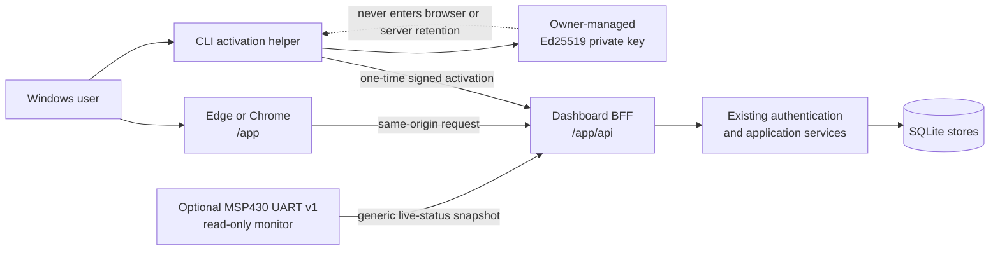

# Local Web Dashboard architecture

## Decision status

The Phase 23 architecture is implemented through the Phase 24 authenticated
vertical slice, Phase 25 optional live monitor, Phase 26 assurance review,
Phase 27 reviewed candidate write workflow, and Phase 28 assurance export. The
current `0.1.0a1` surfaces are the CLI, authenticated loopback REST API, and
same-origin local Dashboard.
Exact Edge zoom is accepted; environment-specific accessibility checks retain
their own bounded results. `/docs` and `/redoc` remain deliberately disabled.

## Decision

ForgeGate will use a local same-origin web control plane served by the same
Python process as the existing FastAPI application. The installed product has
no Node.js runtime requirement and loads no runtime asset from a CDN. A build
toolchain may produce versioned static assets during development; the built
assets must be included in and verified from the wheel.

The implemented production routes are:

| Route | Purpose |
|---|---|
| `/app/` | Hashed static Dashboard assets and browser routes |
| `/app/api/` | Cookie-authenticated browser-for-frontend boundary |
| `/v1/` | Existing Bearer-authenticated public local API |
| `/healthz` | Existing health contract |
| `/openapi.json` | Existing committed and drift-checked direct-API contract |
| `/docs`, `/redoc` | Continue to return 404 |

The browser-for-frontend boundary is intentionally separate from `/v1/`: raw
Bearer tokens must not be exposed to browser JavaScript, while current CLI and
API clients retain the existing challenge/session protocol.

`schemas/forgegate.dashboard-openapi.v1.json` is a separate build-time,
drift-checked contract for the eighteen `/app/api/` operations. It is exported
from the installed wheel during release smoke but is not exposed as interactive
documentation at runtime.

## Component boundary

The UI owns draft form state and presentation only. The application service
owns commands and queries. Domain models own lifecycle, evidence, policy,
identity, and assurance invariants. SQLite remains the authoritative durable
state.

## Local activation boundary

Phase 24 implements and validates this companion activation flow before any
protected Dashboard data is rendered:

1. The browser creates a bounded, one-time activation request at `/app/api/`.
2. The page displays a short non-secret activation code, requested identity,
   role, project scopes, and expiry.
3. A separate CLI command loads the owner-selected key, signs the exact
   challenge, and submits the result over loopback.
4. The BFF validates the signature and trust record through the existing
   authenticator and binds the approved principal to the requesting browser.
5. The browser receives only an opaque, host-only, HttpOnly, SameSite=Strict,
   short-lived Dashboard cookie. No Bearer token or private key is returned to
   JavaScript or placed in a URL.
6. Logout, expiry, revocation, trust reload, process restart, or scope mismatch
   invalidates the BFF session and clears protected UI state.

Cookie authentication adds CSRF concerns. Every state-changing `/app/api/`
request must pass exact Host and Origin checks plus a per-session anti-CSRF
value. The direct `/v1/` API continues to require its Bearer token and does not
accept the Dashboard cookie.

This design does not establish protection from a hostile local administrator or
malware running as the same user. The Dashboard remains loopback-only and not
approved for non-loopback deployment.

## Frontend constraints

- Use strict TypeScript and one explicit state/query layer; choose the component
  framework only after a locked dependency and license preflight.
- Serve production assets from ForgeGate's origin with content-hashed filenames.
- Permit no inline script, `eval`, remote font, analytics, advertisement,
  service worker, or runtime package download.
- Apply a restrictive Content Security Policy and deny framing, MIME sniffing,
  unnecessary referrer data, and cross-origin resource use.
- Render artifact, SARIF, JUnit, plugin, project, audit, and Markdown values as
  untrusted content. Raw HTML is prohibited.
- Use the committed OpenAPI contract to detect frontend/API drift. Generated
  types are build artifacts, not a second API definition.
- Use cursor pagination for projects, candidates, profiles, audit events, and
  security events; cap client caches and clear them on session loss.
- Do not show fabricated progress for synchronous endpoints. A later long-task
  feature requires a versioned Job contract before polling or cancellation UI.

## Implemented Dashboard slices

The implemented surface remains intentionally bounded:

1. `forgegate dashboard` starts the existing loopback service and serves
   packaged static assets without opening a remote listener.
2. Companion activation authenticates one operator or producer without
   exposing the private key or Bearer token to browser JavaScript.
3. Overview displays health, version, identity, role, exact project scopes,
   expiry, and current product limitations.
4. Devices optionally displays independently evaluated serial connection,
   heartbeat freshness, and firmware-reported health from a frozen UART v1
   consumer; it sends no serial bytes and creates no release evidence.
5. Projects lists authorized projects and their current immutable profile
   identity through the existing bounded query.
6. Candidates lists project candidates, creates a candidate through an
   immutable reviewed request, and displays candidate plus audit history.
7. An operator can review and separately confirm DRAFT-to-COLLECTING,
   COLLECTING-to-READY, and READY-to-EVALUATING transitions with exact expected
   revisions; stale state produces a visible 409 and cannot overwrite.
8. An operator can select one local evidence-assembly JSON document, review its
   candidate commit, content identity, receipt/evidence counts, warning
   disposition, size, and browser-computed SHA-256, then request one immutable
   binding. The server never receives or interprets a local path.
9. An operator can select exact material produced from the candidate's frozen
   profile, review the policy identity and hash, execute the domain policy
   engine, and inspect its terminal decision. Presentation code does not
   reproduce rule evaluation.
10. A terminal candidate can generate one reviewed, immutable unsigned-local
   attestation. This neither publishes nor deploys the result.
11. Duplicate submissions replay exactly and reused keys with changed content
   fail visibly without automatic retry. Every successful write reloads both
   the candidate list and detail from authoritative state.
12. Evidence, Decision, and Assurance join the selected candidate to its
   retained evidence binding, exact policy material and evaluation, attestation,
   transition chain, and portable bundle identity through one project-scoped
   read operation. Missing records remain visibly unknown rather than inferred.
13. The Devices page decodes only versioned MSP430 UART v1 fault bits, retains
   unknown bits without invented meaning, and labels every decoded item as a
   firmware report rather than a ForgeGate diagnosis.
14. An operator can review and download the exact current portable assurance
   bundle as a deterministic three-file ZIP. The request is bound to the
   current candidate revision and bundle ID, accepts no path or filename, and
   creates no server-side file or release-audit event.

Automatic evidence collection, plugin execution, session administration, and
trust-store reload remain disabled and visibly
labeled as planned. The implemented local JSON imports are reviewed document
transfers, not arbitrary server-path access or remote acquisition. Empty
controls or mock success paths are prohibited.

## Packaging and lifecycle

- Development may use a separate frontend dev server only with an explicit
  fixed origin and no relaxation in production code.
- The release build produces a deterministic asset inventory recorded in the
  source distribution and wheel checks.
- The operator supplies a validated loopback host and port. The command prints
  the exact `/app/` URL; bind collisions fail through the bounded local server
  startup. Automatic port selection and browser opening are not implemented.
- Closing a browser tab does not imply the server stopped. The page explains
  service state; process shutdown remains explicit and bounded.
- No Dashboard command launches Podman, sends a device byte, reads an AFE/MSP430
  repository, flashes firmware, publishes to GitHub, or changes repository
  visibility. The optional background monitor only reads the explicitly selected
  serial endpoint through the independently implemented public protocol.

## Rejected alternatives

| Alternative | Reason rejected for the first slice |
|---|---|
| Independent hosted SPA | Violates local-first and creates remote trust/deployment scope |
| Electron shell | Adds a second large runtime before the web interaction model is proven |
| Browser-held Bearer token | Exposes a credential to JavaScript and browser storage mistakes |
| Private-key upload or paste | Crosses the existing owner-managed key boundary |
| Unauthenticated localhost page | A malicious local or web-origin request could reach protected data/actions |
| Frontend policy/lifecycle logic | Risks decisions that diverge from CLI and API behavior |
| General file-path fields | Violates the path-free REST boundary and browser/server path semantics |

## Exit gate for implementation

The UX requirements, Dashboard threat model, and acceptance matrix remain the
governing gate. Automation, installed-wheel comparison, Edge and Chrome core
interaction, focus, responsive, error-presentation, assurance review, and the
reviewed write path pass. Edge 100/125/150/175/200% zoom also passes. High
contrast, spoken screen-reader output, and Remote Desktop retain their exact
recorded status; complete accessibility certification is not claimed. Passing
UI tests will not change hardware, producer-authenticity, trusted-time,
non-loopback, or production claims.
