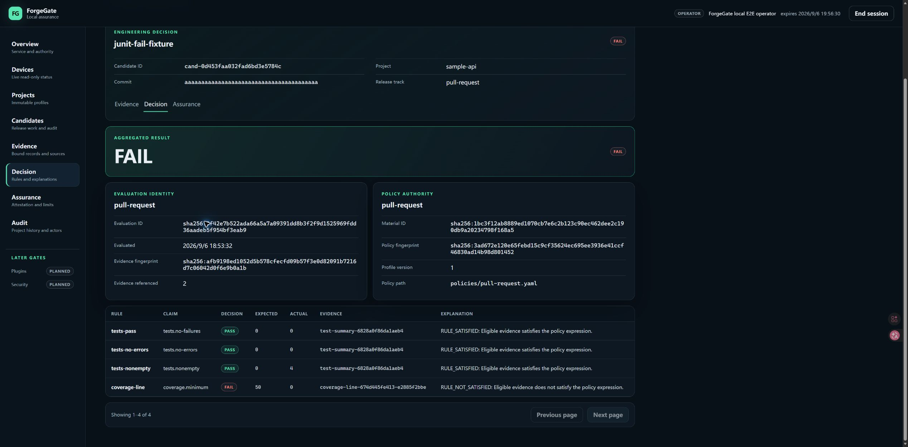
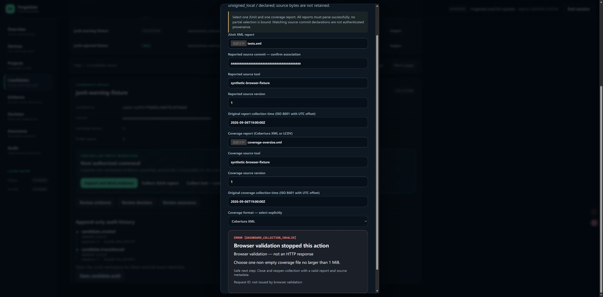

# Phase 33 follow-up — actual-browser report acceptance

Date: 2026-09-06. Baseline: `f6659c4`. Windows / actual Microsoft Edge,
agent-operated browser controls and native file chooser, isolated loopback
service at port 8133. All inputs are synthetic, not AFE/MSP430 measurements.
This completes the scoped LCOV/negative matrix below, not every possible
browser, accessibility or concurrency scenario.

## Actual-browser results

| Case | Input / action | Observed outcome |
|---|---|---|
| B01 | `tests.xml` + `coverage.info`, explicit LCOV | 4 passing tests; repository/module line and branch coverage 1/2 = 50%; 5 records, 2 receipts; independent binding, READY/EVALUATING and four-rule PASS |
| B02 | Cancel LCOV binding confirmation | Returned to COLLECTING revision 1; no binding retained |
| B03 | Submit with no files | Native required-file validation focused the JUnit picker |
| B04 | Same test bytes selected for both files | Duplicate bytes rejected; no binding action |
| B05 | Cobertura XML declared as LCOV | JUnit COMPLETE, LCOV REJECTED (`LCOV_RECORD_INVALID`); no partial binding action |
| B06 | JUnit containing DOCTYPE / ENTITY | `JUNIT_FORBIDDEN_DECLARATION`; valid coverage did not enable partial binding |
| B07 | Reported commit `b` repeated 40 times vs candidate `a` repeated 40 times | Local association validation rejected selection |
| B08 | Coverage time `2099-01-01T00:00:00Z` | Future timestamp rejected |
| B09 | `warning.xml` + LCOV | Declared tests 2 vs observed 1 and missing duration warnings shown; explicit consent required; confirmation showed `retained`; Escape canceled and restored focus |
| B10 | Passing tests + `coverage-low.xml` | Both collectors COMPLETE; coverage 0/2 = 0%; independent binding/lifecycle succeeded; policy FAIL with expected 50 / actual 0, other three rules PASS |
| B11 | 1,048,577-byte coverage XML | Rejected locally; after correction explicitly labeled browser validation, not an HTTP response |
| B12 | Generated summary-only coverage | Line coverage 1/2 = 50%; `COVERAGE_SUMMARY_ONLY` and `COVERAGE_BRANCH_UNAVAILABLE`; no invented branch/module records; explicit consent enabled review; preview closed without binding |
| B13 | Restart isolated server, reload, re-activate, retry B11 then valid LCOV | New packaged page loaded; corrected error visible; valid LCOV preview recovered; retained FAIL decision and rule values survived restart; captured browser error log empty |

Declarations: `synthetic-browser-fixture`, version `1`, original report time
`2026-09-06T19:00:00Z` for both files. Hashes and matching commit declarations
do not authenticate the producer. Evidence stays `unsigned_local` / `declared`.
The 50% threshold is an intentionally permissive sample policy, not ForgeGate's
own test coverage or a production acceptance recommendation.

The existing name `junit-rejected-fixture` was reused for negative previews
followed by valid LCOV recovery, ultimately PASS. Its name does not mean that
rejected input was accepted.

## Defects corrected

1. Browser-only validation displayed `HTTP status: 422` for a locally generated
   error. Errors now carry explicit local/HTTP origin; local validation claims
   neither an HTTP response nor a server request ID. Combined collection uses
   `DASHBOARD_COLLECTION_INVALID`; single JUnit retains its own code. JSON-import
   size recovery preserves the exact 3,900,000-byte limit rather than replacing
   it with 4 MiB. B11 was repeated in actual Edge after the rebuild. Host tests
   separately preserve real HTTP 409/413/422/429/500 and local JUnit labels.
2. A new mixed-case asset hash exposed WindowsPath's case-insensitive ordering
   conflicting with the portable inventory contract. Generation now sorts final
   POSIX path strings using the same case-sensitive rule as validation. A new
   regression uses the exact CSS/JS filenames that triggered failure. This is
   Windows-verified, not a new Linux/macOS execution claim.

No collector, policy threshold, evidence fingerprint, authorization rule or
database schema was relaxed. Schema remains v9. A deterministic boundary-input
generator and its exact-size/no-overwrite regression were added.

## State and identity evidence

Before and after B01 preview/B02–B09, **before final B01 binding**, read-only
SQLite checks found identical row counts in all 17 tables: 4 candidates,
11 snapshots, 7 transitions, 1 evaluation, 1 binding, 12 command idempotency
records, 14 audit events and 3 security events. This is a row-count check, not
a full byte-for-byte history proof. The candidate remained unbound at revision 1.

| Candidate | Final state | Revision | Assembly |
|---|---|---|---|
| `cand-f0f0d21bc00214e2a1da8989` (LCOV recovery) | PASS | 4 | `sha256:ce442d182fa9ea4d43efc4ec35d2799516273900715af31777a75f6b050d59a9` |
| `cand-0d453faa032fad6bd3e5784c` (low coverage) | FAIL | 4 | `sha256:dcc038441d26de5b325c86ab52b79fdbf9561e2c90729c34804aca0d04e49375` |
| `cand-ca37cff8d5bc4d479c079ab0` (boundary previews) | COLLECTING | 1 | none |

Final totals: 3 bindings, 3 evaluations (including the prior Cobertura PASS),
24 audit events, 0 attestations. SQLite `quick_check` returned `ok`. The renewed
test session added one security event. Original 8131 was not restarted/accessed.

- LCOV evaluation: `sha256:f3efb857e7f34602b15b98d7622d2e93d699cad5272d15862f29446013362312`
- Low-coverage evaluation: `sha256:3f42e7b522ada66a5a7a09391dd8b3f2f9d1525969fdd36aadeb5f954bf3eab9`
- Shared policy material: `sha256:1bc3f12ab8889ed1070cb7e6c2b123c90ec462dee2c190db9a20234798f168a5`
- Selected LCOV bytes: `8d690d23304344c051e3a05f39c7d72ff46d91e1d5d561de544d92d81c58a53f`
- Selected low-coverage XML: `674d445fe413f6bc38cf75ee73d9abfcc3a2f9ffa94d32910bac48cc06d2e3b8`

## Reproduction and regression gates

Use new isolated directories, never the live device database:

```powershell
python tools/manual_dashboard_collection.py work/my-browser-fixture --multi-report
python tools/manual_report_boundaries.py work/my-boundary-inputs
```

Start the documented Dashboard against the fixture with an authorized existing
trust store and an unused loopback port, without `--msp430-port`. Activate an
operator session scoped to `sample-api`. Choose the committed files under
`examples/dashboard-multi-report/` and `examples/dashboard-junit/` through the
picker; use fixture-specific policy material for evaluation. The boundary helper
refuses existing directories and pads valid summary XML to 1 MiB + 1 byte.
Generated large files, databases, private keys, tokens and machine-path logs are
not part of the retained gallery.

| Gate | Result |
|---|---|
| `python tools/verify.py` | PASS: 1001 tests, 3 Windows-symlink skips; 95.37% branch-aware coverage; Ruff/format/mypy (97 files), schema/OpenAPI drift and CLI/API 33/33 |
| TypeScript check + production build | PASS |
| Frontend host tests | PASS: 73 (30 combined/import, 18 JUnit, 12 Audit, 13 activation) |
| Clean wheel/sdist smoke | PASS; includes new mixed-case asset inventory |
| Isolated exact installed HTML / health | HTTP 200 / 200; actual authenticated browser checks separately recorded above |

Local logs: `work/browser-acceptance-verify.log`,
`work/browser-acceptance-frontend.log`, `work/browser-acceptance-release.log`.
Earlier cases ran before the label correction; after the final build B11,
valid LCOV recovery and retained decision readback were repeated. HTTP failure
injection, stale-response races and numeric overflow variants remain host-test
evidence, not newly executed manual cases in this report.

## Unedited actual browser captures





| File under `docs/assets/` | SHA-256 |
|---|---|
| `forgegate-dashboard-lcov-preview.jpg` | `a2384c438edf3640e15ee2bd8e7081247b70982394d0ec91cb627fa49250430e` |
| `forgegate-dashboard-lcov-decision.jpg` | `207f49dff33a2cd489d2809b4efaf1aeb1ea5c1f95912ed37c3d3a9efd5a7a51` |
| `forgegate-dashboard-report-rejected.jpg` | `62b4cf78473450a4f2d3915a9cf0eb20ee500f54bed5dcc6f7df75e6bb36aff7` |
| `forgegate-dashboard-coverage-warning.jpg` | `a025539fd4eb80d0df71ea70cff18a00a82905148cbb38b73e9ac74b1d804e8c` |
| `forgegate-dashboard-low-coverage-fail.jpg` | `a16ee3a18185c797b09a28a2bd55e05722eef9769ace1b3b9ac36122701525ac` |
| `forgegate-dashboard-low-coverage-rules.jpg` | `b273f7d483965b57cfab82c32f1b4eb49d6fcd1a59c60bcc4ef547667a684daa` |
| `forgegate-dashboard-local-validation.jpg` | `53590aa95961ef2e0302172d6d09df0e41c0f8377dad07d9815f3286b597f567` |

## Remaining boundaries

Next: durable collection tasks, ownership, bounded private retention, restart
recovery and explicit cancellation. No queue, raw-artifact retention, hardware
validation, production readiness, high-contrast/Narrator/RDP certification or
public release is claimed. GitHub remains paused. Original 8131/MSP430 upgrade
still requires explicit approval; only isolated 8133 was restarted here.
