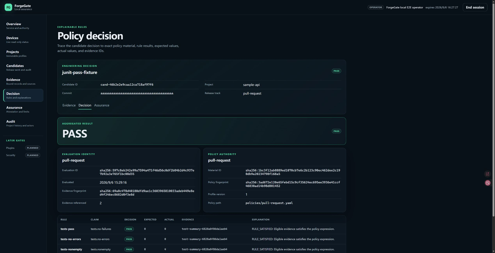

# Phase 33 — combined Dashboard report collection

Date: 2026-09-06. Scope: local Windows Alpha, synthetic inputs, no GitHub writes
and no new hardware access. Baseline: local Phase 32 commit `9828398`.

## Delivered

- Candidate-scoped JUnit + Cobertura/LCOV preview using existing collectors and
  assembler. One or two files; one test and one coverage family at most.
- Per-file byte, XML/LCOV structure and normalized-output limits; duplicate
  reports and unsafe browser integer counts rejected. No partial binding.
- Separate declared metadata/time per report; fixed `unsigned_local` / `declared`.
- Per-source hashes, evidence kind/scope, explicit warning consent, no automatic
  retry, stale-response cancellation, and independently confirmed binding.
- Exact `assembly_json` transport preserves fingerprint-bearing numeric lexemes.
  Backend fingerprints and historical canonicalization remain unchanged.

## Actual browser defect and correction

The initial real Edge upload parsed correctly but the separate binding returned
HTTP 422. The cause was JavaScript reserialization of Python JSON `50.0` as
`50`, changing the assembly fingerprint. Python-only HTTP tests had retained
the original floating-point representation and did not expose it.

The corrected preview returns the canonical assembly as text as well as the
normal parsed view. The browser checks semantic agreement, then embeds the
original text in the separately confirmed binding request. Dedicated tests
reproduce the fingerprint rejection, preserve float and large-integer lexemes,
and reject missing/mismatched exact text. The backend continues to revalidate
the entire assembly. Existing evidence/policy JSON-file imports now reuse the
same original-text envelope to prevent the same numeric coercion; these extra
import-envelope cases are host-tested, not separately re-certified in Edge.

The browser preview also lacked kind/scope labels for repeated coverage values.
Labels now distinguish repository/package/module line and branch records.

## Verification

| Gate | Observed result | Boundary |
|---|---|---|
| `python tools/verify.py` | PASS; 999 passed, 3 skipped; 95.37% branch-aware, 10,812 statements / 2,898 branches | Local Python host; skips require Windows symlinks |
| TypeScript check/build | PASS | Production asset build, not browser acceptance alone |
| `pnpm test:dashboard` | 72 passed | 29 combined/import, 18 JUnit, 12 Audit, 13 activation host cases |
| Contracts | 41 document + 3 artifact schemas and direct/BFF OpenAPI drift gates pass; 20 BFF paths, 21 operations | API compatibility; path count is not operation count |
| CLI/API interaction smoke | 33/33 pass within verify | Not hardware testing |
| Clean-wheel/sdist smoke | PASS, including source manifest, installed BFF contract and optional MSP430 dependency import | Packaging gate only; no hardware read or public release |
| Actual Edge combined Cobertura | Preview, reviewed binding, READY/EVALUATING, policy PASS and rules inspected | Synthetic local browser workflow |
| LCOV, low coverage, rejected format, warnings, invalid/duplicate/oversize inputs | Host regression PASS | Fresh complete manual browser matrix remains open |

Local untracked execution logs: `work/phase33-verify-final.log`,
`work/phase33-frontend.log`, `work/phase33-release-final2.log`. Do not publish
raw machine-path logs, private identities, keys, session identifiers or databases.

## Browser input/output evidence

Separate isolated service at port 8133, no MSP430 monitor configured. The
existing 8131 MSP430 process was not restarted during the recorded browser run.
Synthetic candidate: `cand-46b2e2e9caa12ca718af97f6`; declared commit `a` repeated
40 times. Source times: JUnit `2026-09-06T12:00:00Z`, coverage
`2026-09-06T12:01:00Z`; tools labeled `synthetic-junit` / `synthetic-cobertura`.

| Input / result | Expected | Actual |
|---|---|---|
| `tests.xml` | total 4, passed 4, failures/errors/skipped 0, duration 0.5 s | Exact match |
| `coverage.xml` | repository lines 1/2, branches 1/2; both 50% | Exact match |
| Immutable binding | 2 receipts, 7 records; candidate still COLLECTING | Exact match; initial 422 fixed and re-tested |
| Synthetic policy | no failures, no errors, nonempty tests, repository line coverage >= 50 | Four PASS rules; actual coverage 50 |

SHA-256 of exact browser-selected bytes:

- JUnit (92 bytes): `6828a0f86da1aeb406c1cb05f9fc172705ddc33b8dab707027e93c6c0e2f2c10`
- Cobertura (374 bytes): `6550ad7baea79b07cacf2e3c7901cf6be005445085a5b90378664136233c7f10`
- Retained assembly: `sha256:90d9cb387c4c1f1358ad396812cc7c4dfe88b84826ada940998714cd8357c3a1`
- Policy evaluation: `sha256:597c8eb242e99a7594a471f46d56c0df2b84b2d4c937e7b92a3e765f1bc08d35`

Unedited actual Edge screenshots:

## Remaining boundaries / next slice

This is not durable background collection, a task center, raw-artifact storage,
test execution, source authentication, hardware measurement or production
readiness. The 50% example is a deliberately permissive **synthetic fixture**,
not ForgeGate's own coverage or an AFE/MSP measurement. High contrast, spoken
screen-reader output and real Remote Desktop validation remain separate gates.

Next: define durable job state, ownership, restart/cancellation/retry semantics
and private bounded retention before implementing asynchronous collection.
Keep GitHub paused. Existing long-running servers need a coordinated restart
after package/asset upgrades; an old process is not automatically upgraded.
The final isolated 8133 process was restarted and authenticated, with retained
four-rule PASS readback and no captured browser console errors. Exact installed
HTML and health diagnostics both returned HTTP 200. The original 8131 process
still awaits owner approval for a coordinated upgrade/restart; do not assume
its in-memory routes or asset inventory match newly built files.
