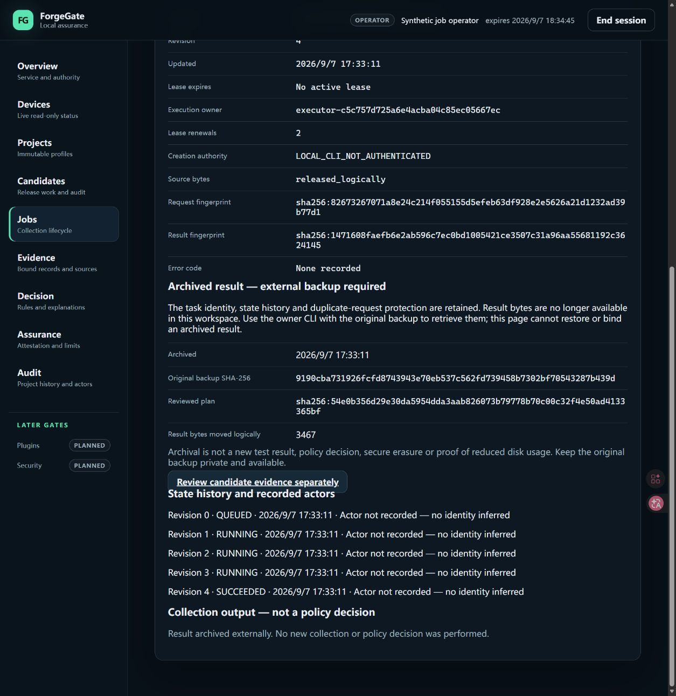

# Phase 40 — reviewed job archival acceptance

Date: 2026-09-07. Platform: Windows, Python 3.12.10. Scope:
**LOCAL_HOST_TEST / SYNTHETIC**, plus actual isolated Edge browser inspection.
No GitHub access/write, production migration, MSP430 access or hardware claim.

## Delivered vertical slice

The owner can create an exact paired backup, explicitly enable job-store v4,
review a one-job plan, confirm its fingerprint, archive a terminal unbound
result, inspect an immutable receipt, and read the original payload from its
explicit backup. Later v4 workspace snapshots/restores retain archive receipts
and list the earlier external backup dependencies.

The archive transaction sets only the selected job result to NULL and inserts
its receipt. Job state/revision/identity, raw event records, request-key replay
and candidate history are preserved. Logical capacity returns; physical file
shrinking, secure erasure, automatic retention and browser archive writes do not
occur. See [owner operations and limitations](../docs/JOB_ARCHIVAL.md).

## Verification evidence

The final command results are recorded in the companion
[machine-readable acceptance](PHASE_40_JOB_ARCHIVAL_ACCEPTANCE.json).

- 46 new archival regressions; 94 combined archival/backup cases pass. The four
  archival/model/workspace/CLI modules have 100% branch-aware coverage across
  533 statements and 60 branches in that focused run.
- Guards cover missing/hash-mismatched/stale backup, malformed/oversized/duplicate-key
  plans, review-confirmation mismatch, revision/time/candidate changes, already
  bound results, active jobs, immutable rows/events, exact replay/conflicting
  replay, quotas and duplicate-request preservation.
- Fault tests hold either database's writer lock, probe both reservations at
  final recheck, inject receipt-insert failure, and inject timeout after the
  writes but before commit. They check exact rollback of result/receipt state.
  These are controlled host faults, not physical power-loss certification.
- A current binding blocks archival even when candidate revision is unchanged.
  A previously exported assembly can still bind later; a regression verifies
  that later backups retain this association and the external dependency.
- Dashboard host tests confirm archived metadata/no-store output and `409` for
  stale export/bind requests. These are API host tests, not browser-injected 409s.
- 128 frontend host tests pass, including archive disclosure/history and absence
  of result mutation buttons. TypeScript check, production build and packaged
  asset inventory pass. No frontend dependency was added.
- v1 workspace manifest schema remains byte-for-byte unchanged. Three new
  versioned document schemas and the Dashboard OpenAPI are generated; direct API
  routes remain unchanged. Totals: 49 document and 3 artifact schemas.
- Clean-wheel `release_smoke.py` passes, including cross-process plan/apply/replay,
  original result readback and v4 backup/restore. The tested wheel hash is in the
  JSON receipt; it identifies this smoke artifact, not a public release.

## Actual browser acceptance

Created a new synthetic workspace using:

```powershell
python tools/manual_dashboard_jobs.py work/new-archive-demo --archive-complete
```

The seed explicitly cancels its two synthetic running records, snapshots the
pair, migrates the job store and archives its completed fixture. It does not
touch the owner's running workspace, connected board, or existing credentials.
A separate loopback server and ephemeral synthetic operator session were used.

The in-app browser control failed with navigation/focus timeouts; that browser is
**NOT ACCEPTED** for this run. Actual **Edge** then passed:

1. Start activation and approve the existing ephemeral fixture identity through
   the CLI; no private key is entered in the browser.
2. Open the archived job detail. Observe terminal revision **4**, **2** renewals,
   **5** historical events, the original backup SHA-256 and **3,467** logical
   archived result bytes. No assembly download/binding/execute/cancel button.
3. Follow the candidate-evidence link. Observe **COLLECTING / Evidence not bound**.
4. Return and reload. Observe the same retained archive metadata and history.
5. End the session. Observe activation-only content; close the temporary Edge tab
   and stop only the isolated test server.



Screenshot is actual rendered Edge content, not a mockup; only synthetic IDs and
test identity are shown. A separate CLI read of the source backup retained the
exact summary: **4 total, 3 passed, 1 failure, 0 errors, 0 skipped, 0.5 seconds**,
with evidence status **failed**. The unchanged `SUCCEEDED` task state proves
parsing completion, not test success or a policy PASS.

## Failure notes and remaining gates

- The first revision-change test tried to advance an unbound candidate to READY.
  Existing evidence-binding protection correctly rejected it. The fixture was
  corrected to bind then advance before checking archival's stale-candidate guard.
- Updating help text from v3 to v3/v4 exposed a line-wrapping assumption in the
  CLI help assertion. The test now checks the actual v3/v4 output and the same
  no-automatic-migration/scheduling boundary; functionality was not relaxed.
- The normal three Windows symlink tests remain skipped because creation is
  unavailable on this host. No new native high-contrast, spoken screen-reader,
  Remote Desktop, hostile-local-owner, long-duration or physical hardware test.
- Archive payloads remain in earlier external ZIPs. Newer backup validation
  checks dependency metadata, not availability of the earlier ZIPs. Retain them.
- There is no UI archiving/restore action, capacity dashboard, automatic worker,
  encryption, disk compaction or automatic recovery. The existing owner service
  was not upgraded/restarted or migrated during this acceptance.
- GitHub synchronization remains paused. This is a local engineering checkpoint,
  not a release or authorization to change public portfolio claims.
