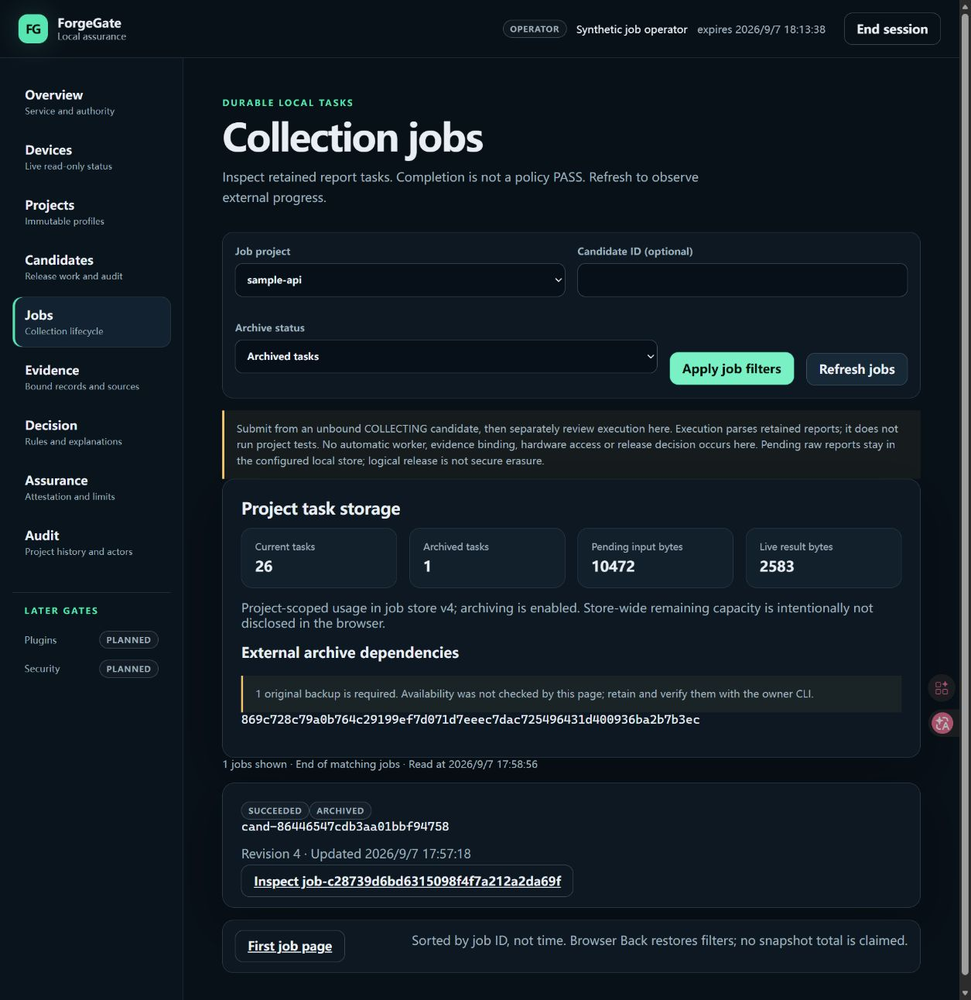

# Phase 41 — job capacity and archive visibility acceptance

Date: 2026-09-07. Platform: Windows, Python 3.12.10. Scope:
**LOCAL_HOST_TEST / SYNTHETIC**. No production store, GitHub, MSP430, hardware,
external backup probe, or archive write was used by this phase.

## Delivered vertical slice

The owner CLI now returns a strict store-wide capacity document covering current
and archived logical records, available slots, retained normalized input/result
bytes, v3/v4 archive capability, and distinct external backup hashes. It states
that dependency availability was not checked and physical database size was not
reported.

The authenticated Jobs page now filters All, Current, or Archived records,
labels each returned task, and displays only the authorized project's usage and
dependency identities. Store-wide remaining capacity is withheld from the
browser to avoid disclosing other-project activity. Filtering scans the complete
quota-bounded identity set, correcting the prior first-100 scan boundary.

## Verification evidence

The companion [machine record](PHASE_41_JOB_CAPACITY_ACCEPTANCE.json) contains the
final exact command totals.

- Focused Python checks cover v3/v4 semantics, exact byte accounting, CLI output,
  archive filters, an archived identity beyond the first 100 rows, project privacy,
  invalid filters and fail-closed model coherence.
- Frontend checks cover filtered links, current/archive labels, project usage,
  dependency warnings, and the no-recovery-claim empty state.
- Schemas, Dashboard OpenAPI, production assets and packaged inventory are
  generated and drift checked. No frontend runtime dependency was added.
- Final `tools/verify.py` passes: 1,207 Python tests passed and 3 expected
  symlink tests skipped; branch-aware coverage is 95.67% across 12,166
  statements and 3,180 branches. Ruff, format, strict mypy, 51 document plus
  3 artifact schemas, both OpenAPI documents, assets and 33 interaction-smoke
  outcomes pass. All 130 frontend interaction tests pass.

## Actual browser acceptance

An isolated synthetic v4 workspace, an ephemeral operator identity and a
separate loopback server on port 8141 were used in actual Edge. The page showed
26 current tasks, 1 archived task, 10,472 pending-input bytes, 2,583 live-result
bytes, and exactly one external backup dependency. Archived filtering returned
only the archived `SUCCEEDED` task; Current filtering excluded it. The detail
link and Back action retained `archive_filter=archived`.

The screenshot contains only synthetic IDs and data. Its SHA-256 is
`833088164b3ef2382a2bd4b6194303569028b528e6c792836c9deb212dc1850d`.
The temporary browser tab and isolated server were closed after acceptance.

## Evidence boundaries

Counts and bytes are refreshed logical-store observations, not a physical SQLite
or WAL measurement and not a transaction-wide UI snapshot. A dependency hash
does not prove that a ZIP exists, is readable, or can restore a result. No backup
file is opened by capacity reporting. No candidate, evidence binding, policy,
attestation, job, archive, device, repository, or GitHub state is changed.

Clean-wheel release smoke passed with exit code 0 and the final
`ForgeGate release smoke: PASS` marker. The tested wheel SHA-256 is
`f6e3cb9e8b164009e8b6c8a8aefe0bdef67dcdc6941334f7f0909b973d59d984`; the
tested sdist SHA-256 is
`f08e54fd785d4b8212f9fc1d195076ee83f1cddca41afbecf0a39fad8f80e7d7`.
These hashes identify local smoke artifacts built before these final report
edits; they are not published-release identifiers.
