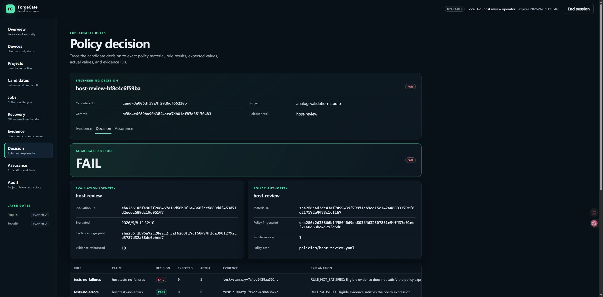
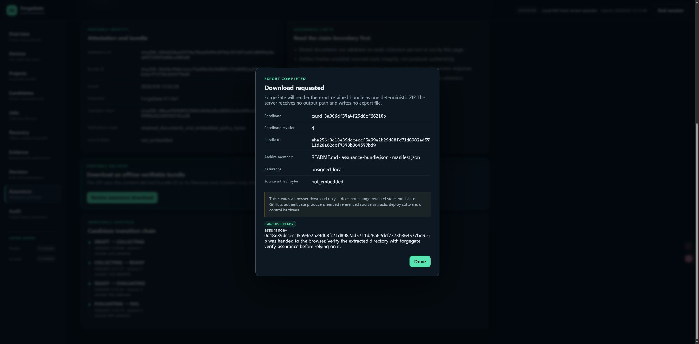

# Phase 50 — real AVS host reports through release assurance

Date: 2026-09-08. Local working-tree checkpoint above ForgeGate `81710fb`,
preserving Phase 46–49 work. GitHub synchronization remains paused.

## Outcome

**ForgeGate integration accepted; reviewed AVS baseline FAIL.** Real software
reports now have a reproducible file-only consumer pack and complete the existing
Dashboard bind/evaluate/attest/download workflow. No new platform, scheduler,
upstream code dependency or hardware controller was added.

AVS commit `bf8c4c6f59ba9063524aea7db01df87d35170483` was exported with `git archive`,
installed in an independent Python 3.12.10 environment, and tested there. The
active AVS worktree was dirty and was neither included nor edited. This report
does not characterize its ongoing uncommitted changes. Environment versions:
pytest 8.4.2, pytest-cov 7.1.0, coverage.py 7.16.0, Ruff 0.16.6. Dependencies were
resolved for this run; timings and future fresh installs are not bit-reproducible.

## Expected versus actual

| Input or check | Expected handling | Actual |
|---|---|---|
| Real JUnit | Preserve all results, fail the zero-failure rule | 2,470 tests: 2,469 passed, one failure, zero errors; pytest exit 1 |
| coverage.py XML | Preserve statement coverage without inventing branches | 13,834 / 13,834 lines, 100%; no branch measurement; `COVERAGE_BRANCH_SUMMARY_ONLY` explicitly retained |
| Ruff S-rule SARIF | Keep active results and block the strict zero-active policy | 15 untriaged candidates: S101 ×12, S311 ×2, S105 ×1; not 15 confirmed vulnerabilities |
| Upstream quality report | Copy measured values and preserve check outcomes | All 15 host checks true; seven benchmark records including failed-check count 0 |
| Four collectors | Complete receipts, commit/hash references retained | Four receipts, 130 normalized records; unsigned_local / declared |
| Consumer policy | FAIL if either failure count or active scanner count is nonzero | 12 rules: 10 PASS, two FAIL (`tests-no-failures`, `static-review`) |
| Actual Edge reviewed workflow | Distinguish command success from engineering decision | Binding, READY, EVALUATING, policy import, FAIL, attestation and ZIP download completed |
| Downloaded archive | Match retained bundle bytes and validate offline | 245,775 bytes; exact deterministic archive match; independent CLI exit 0 / VALID / decision FAIL |
| Wrong extraction directory | Reject incorrect content-addressed directory name | `ASSURANCE_BUNDLE_DIRECTORY_MISMATCH`; correct ZIP-stem directory then validates |

Measured synthetic host workloads: 10,000-record replay 0.597524 s / 13.102 MiB;
10,000 progress events 0.037641 s; 10,000 live observations 0.208618 s / 1.355 MiB;
demo 0.034685 s. Timing bounds were 5 s; replay/live peak-memory bounds 128/64 MiB.
These are one host run, not hardware measurements or service-level guarantees.

The failing test is the frozen Phase 5 public-contract golden SHA-256 assertion.
Phase 2 and Phase 3 golden files do not match hashes recorded in the Phase 5
manifest. All three archived files' Git object IDs match the frozen commit,
excluding archive newline conversion as the explanation. Do not automatically
regenerate goldens to make the check pass; see the [upstream handoff](PHASE_50_AVS_UPSTREAM_HANDOFF.md).

## Implementation and validation

- [Consumer pack and reproduction](../examples/analog-validation-studio-host/README.md).
- `tools/avs_host_acceptance.py`: bounded original reads, strict versioned
  performance mapping, exact-byte receipts, new-directory-only preparation and
  explicitly unbound candidate. No imports from AVS and no access to hardware.
- 14 new tests exercise conversion, failed-check preservation, incompatible
  contracts, ambiguous/invalid measurements, no-overwrite preparation and a
  synthetic failing candidate through portable assurance verification.
- Full `tools/verify.py`: **1,406 passed, 3 skipped**, 95.89% branch-aware package
  coverage; Ruff, formatting, mypy, committed schemas/OpenAPI, asset integrity and
  interaction smoke pass. This is ForgeGate's suite, separate from AVS's results.
- Clean-install `tools/release_smoke.py`: exit 0, `ForgeGate release smoke: PASS`;
  source distribution / wheel and existing CLI delivery paths remain functional.
- Frontend code is unchanged in this slice; Phase 49's 158 frontend host results
  remain historical. This slice adds actual Edge workflow acceptance, not a new
  native assistive-technology matrix or hardware test.
- Browser console: zero error/warning entries during the reviewed workflow.
  The automation download-event wait timed out, but the browser completed the
  download; the exact named file was located on disk and independently verified.

## Retained evidence and limits

[Path-free machine record](PHASE_50_AVS_HOST_EVIDENCE.json) contains report hashes,
all rule expected/actual values, measured host values, identities and screenshot
hashes. Original reports, producer logs, database, local identity/key, source
archive and downloaded bundle remain private outside the repository. The bundled
attestation retains normalized evidence and policy bytes, **not original reports**.
CLI identity authentication does not authenticate imported report producers.

Screenshots are unmodified page captures; they show no private mailbox or key.
GitHub, deployment, hardware access and producer authentication: NOT PERFORMED.
The temporary acceptance server is not a replacement for the user's live service.
Further work should use an owner-approved new producer commit or a concrete
delivery blocker, not repeat infrastructure work or weaken failed policies.
