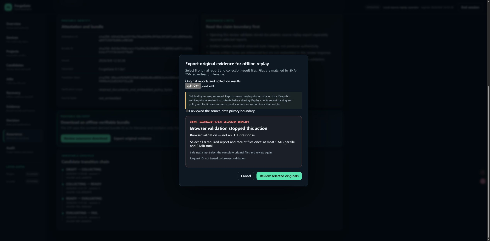
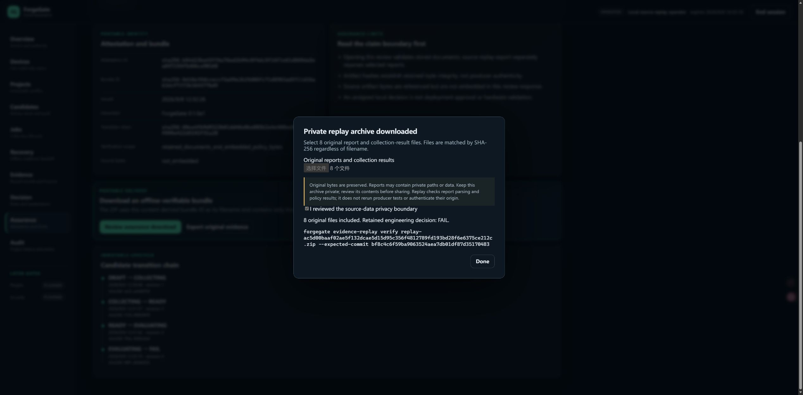

# Phase 51 — private source evidence and offline replay

Date: 2026-09-08. Local working-tree checkpoint above `81710fb`; pre-existing
Phase 46–50 changes preserved. GitHub synchronization remains paused.

## Outcome

**Source replay integration accepted; retained AVS decision remains FAIL.** A
reviewer can now receive the exact original collector inputs and collection-result
files, reparse them without a database, reconstruct the bound evidence and
recompute the original policy. This closes the missing original-report delivery
step without changing the existing three-file assurance ZIP.

This run reused Phase 50's frozen AVS commit
`bf8c4c6f59ba9063524aea7db01df87d35170483`; it did not run AVS tests again or alter
its active worktree. The replay inputs are four raw collector reports plus four
original collection-result JSON files. The benchmark JSON is Phase 50's mapped
collector input: this replay does not execute or attest that upstream mapper.

## Expected versus actual

| Check | Expected | Observed |
|---|---|---|
| Source selection | Exact 8 original files, no regenerated receipts | 1,035,019 input bytes, all hashes/sizes matched |
| Parsers and assembly | Retain all results and warnings | 4 collections and 130 evidence records reconstructed exactly |
| Policy replay | Preserve Phase 50 failures | VALID archive with decision FAIL; original evaluation unchanged (12 rules, 10 PASS / 2 FAIL) |
| Incomplete Edge selection | Refuse before request; explain recovery | `DASHBOARD_REPLAY_SELECTION_INVALID`, asks for all eight files; reselection works |
| Privacy confirmation | No export without acknowledgement | Explicit acknowledgement prompt; complete selection remains reviewed |
| Real Edge download | Verify identity/hash and offer private ZIP | 1,281,988 bytes, 10 members; downloaded file exactly matches CLI export |
| Independent CLI verification | Validate correct commit, reject a different one | Exit 0 / VALID / FAIL; wrong commit exits 3 with `REPLAY_COMMIT` |
| Candidate mutation | Export must not bind, transition or reevaluate stored state | Browser test database bundle remains identical to original, revision 4 |
| Existing export directory | Refuse overwrite | CLI unit and clean-wheel cases return exit 3 |

Archive SHA-256:
`aa99093ee96d2d1a4eb1390208ccac92c6ccd7d4c2b0217010343007d3225445`.
Content-addressed replay ID:
`sha256:ac5d00baaf02ae5f132dcae5d15d95c356f4812789fd193bd28f6e6375ce212c`.
Full input and screenshot hashes: [machine evidence](PHASE_51_SOURCE_REPLAY_EVIDENCE.json).

## Implementation and regression evidence

- New `evidence-replay export` and `verify` CLI commands; deterministic bounded
  ZIP containing manifest, assurance document and original blobs. The verifier
  does not extract paths, execute commands/plugins, contact a network or write a
  database. All source bytes must reproduce the retained results before export.
- Existing built-in collectors and policy engine are reused. The collection
  loader now accepts its existing artifact-source protocol rather than requiring
  a filesystem registry; no AVS runtime dependency or new framework is added.
- Dashboard POST reuses operator/project/Origin/CSRF checks, retains revision and
  bundle identity, accepts no server-side source/output path and adds no raw
  report retention. The frontend reviews exact bytes, requires privacy consent
  and validates response headers plus the full archive digest before download.
- 14 new Python cases: PASS/FAIL roundtrips; CLI export/verify/no-overwrite;
  missing, extra, modified, wrong-commit, trailing, malformed, compressed,
  traversal-member, manifest and version refusal; parser/policy mismatch and
  bounds; Dashboard unauthorized, CSRF, revision, consent and missing-input
  refusal, successful export and unchanged candidate bundle.
- 10 new production-TypeScript host cases: review/consent, exact upload bytes,
  missing/duplicate/oversized/changed/unknown inputs, close-during-read cancellation
  and controlled HTTP 413/429/500 responses with no automatic retry. These HTTP
  fault presentations are host-harness tests, not this run's real Edge cases.
- Full `tools/verify.py`: **1,420 passed, 3 skipped; 95.80% branch-aware package
  coverage**, Ruff/format, mypy (119 source files), schemas, direct/BFF OpenAPI,
  asset inventory and existing 33-case interaction smoke pass; exit 0.
- `pnpm test:dashboard`: **168 passed, zero failed**. TypeScript checking and the
  shipped Dashboard asset build pass.
- `tools/release_smoke.py`: exit 0 and **ForgeGate release smoke: PASS**. Its
  clean installed wheel exports a source replay, rejects overwrite, verifies the
  expected commit and rejects a wrong commit, in addition to existing checks.

## Defects found and corrected

The first real-browser incomplete selection was correctly refused but displayed
only a generic unexpected error. It now has a specific validation code, required
file count and a safe next step; actual reselection and download were retested.
The first full regression also found the exact Dashboard OpenAPI path snapshot
needed its new endpoint; it was updated and the full gate rerun successfully.
These were local development failures, not silently omitted from acceptance.

## Retained screenshots

Unmodified actual Microsoft Edge page captures; no private report bodies, key,
mailbox or local source path is shown.

## Limits and handoff

See [operations and format limits](../docs/EVIDENCE_REPLAY.md). Only complete,
bounded built-in software collections are supported; non-reproducible custom
parser settings are refused. Alpha version identity is not an immutable build
identity: retain the exact tested ForgeGate revision/wheel for later replay.

Original reports, ZIP, local database and identity/key remain **private outside
the repository**. Originals are neither redacted nor encrypted by this feature.
Do not publish them without a separate content/privacy review. The test server
and its browser session/tab were ended; the user's service was not restarted.

This is parsing/policy replay of retained software reports, not a new producer
test run, validated security findings, producer authentication, hardware testing,
remote deployment or fresh native assistive-technology acceptance. AVS's frozen
golden-manifest failure and 15 untriaged static candidates remain the upstream
handoff issues. No main-branch merge, push, release or GitHub change occurred.

Next product work: operator delivery acceptance using these instructions; when
an owner-approved new upstream commit/disposition is available, run it as a new
immutable candidate. Repeating the unchanged baseline or expanding process
management is not required to use this delivered slice.
