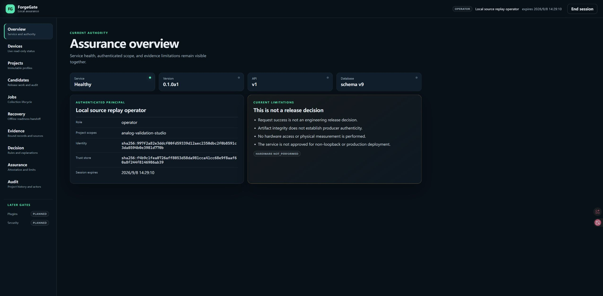
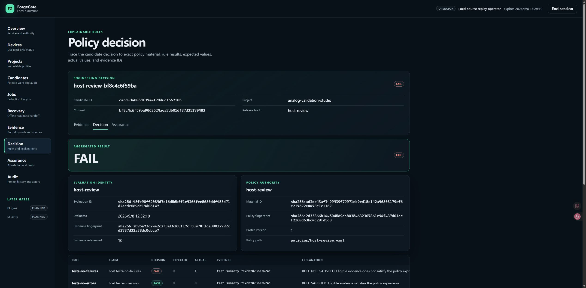
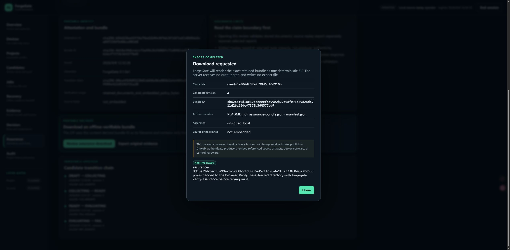

# Phase 52 — reviewed Windows installed-wheel delivery

Date: 2026-09-08. Local working-tree checkpoint above `81710fb`, preserving all
uncommitted Phase 46–51 work. GitHub synchronization remains paused.

## Outcome

**Windows installed-wheel delivery accepted locally.** The current ForgeGate
runtime can be built without stale frontend output, installed into an independent
Python 3.12 environment, started against a copied candidate database, activated
as a scoped operator in actual Microsoft Edge, and used to review and download
the retained AVS assurance result.

The candidate correctly remains **FAIL**, not a manufactured delivery PASS. The
downloaded guarantee is an internally `VALID` statement of that FAIL decision.
This acceptance used a working tree with changes, so it is a local test artifact,
not a clean-commit, signed, licensed, published or production release.

## Defect found and fixed

The first direct wheel build from the long-lived repository included obsolete
hashed JavaScript/CSS files still present under the ignored `build/` directory.
Its committed asset inventory described five files but the wheel contained two
extra historical assets. An explicit installed-wheel asset check refused it.

`tools/build_windows_delivery.py` now creates the source distribution first,
extracts it into a fresh temporary tree, builds the wheel there, verifies the
exact Dashboard member set and hashes, and only then creates a new output
directory with the wheel, sdist and build receipt. Reusing a destination exits 3.
The release smoke now uses the same fresh-sdist construction, so normal clean
installation evidence exercises the retained delivery route.

## Expected versus actual

| Check | Expected | Actual |
|---|---|---|
| Retained build | Fresh source tree; no stale UI files | Wheel contains 114 members and exactly 5 inventoried Dashboard assets |
| Artifact association | Exact hashes and source-state disclosure | Wheel SHA-256 `48b1a873…85bc3c`; receipt says `WORKING_TREE_WITH_CHANGES` |
| No overwrite | Existing destination refused before build | Exit 3; retained directory unchanged |
| Independent runtime | Import from new environment, dependencies complete | Python 3.12.10 isolated `site-packages`; `pip check` PASS |
| Startup diagnosis | Installed HTML and health agree | `DASHBOARD_REACHABLE`, health 200, app 200 |
| Operator activation | Exact role/project only | AUTHENTICATED as operator for `analog-validation-studio` |
| Data preservation | Copied AVS candidate remains authoritative | Candidate revision 4; 4 collections / 130 records; 12 rules (10 PASS / 2 FAIL) |
| Decision presentation | Do not confuse delivery success with product result | Tests failure actual 1 and static-review actual 15 remain visible; aggregate FAIL |
| Browser assurance download | Correct immutable candidate/bundle | 245,775-byte ZIP; browser console has zero error/warning entries |
| Installed-wheel offline verification | Database-independent exact readback | `VALID`, decision `FAIL`, `unsigned_local`, source bytes not embedded |
| Hardware | Disabled by default | MSP430 option absent; NOT PERFORMED |

Path-free machine evidence and screenshot hashes are retained in
[Phase 52 evidence](PHASE_52_WINDOWS_DELIVERY_EVIDENCE.json). The accepted build,
runtime, copied database, private identity/key and downloaded ZIP remain outside
the repository. The earlier contaminated diagnostic wheel is explicitly not the
accepted artifact and was not published.

## Actual browser acceptance

The actual Edge sequence was Overview → Projects → Candidates → candidate detail
→ Evidence → Decision → Assurance → reviewed ZIP download. Project title, commit,
revision, history, evidence counts, policy material, expected/actual values and
assurance boundary all loaded from the isolated installed wheel. The session was
ended, its tab closed, and only the isolated foreground server stopped.

Final ForgeGate gate: **1,423 passed / 3 skipped**, 95.80% branch-aware package
coverage; strict mypy passes across 120 source/tool files; all 33 interaction
checks pass. The unchanged production frontend suite remains **168 passed / zero
failed**. Schemas, direct/BFF OpenAPI and five-file asset inventory pass. The
fresh-sdist clean-install release smoke exits 0 with
`ForgeGate release smoke: PASS`.

The evidence table faithfully displays scope values supplied by upstream reports.
This run observed source-environment path components in coverage scopes, so that
page requires content/privacy review before any public screenshot. The three
retained screenshots avoid those rows. ForgeGate does not silently rewrite the
immutable evidence to improve presentation.

## Evidence boundary and next gate

This proves a local Windows wheel can start and execute the reviewed operator
path against a copied database. It does not prove a clean Git revision, installer,
Windows service, auto-update, trusted timestamp, signature, producer provenance,
hardware behavior, non-loopback deployment or production readiness. The AVS
golden-manifest failure and untriaged static candidates remain upstream issues.

The next gate is owner-operated acceptance using the documented installed-wheel
workflow. After Phase 46–52 changes are reviewed and committed, repeat the build
from that clean commit before considering a release or GitHub synchronization.
