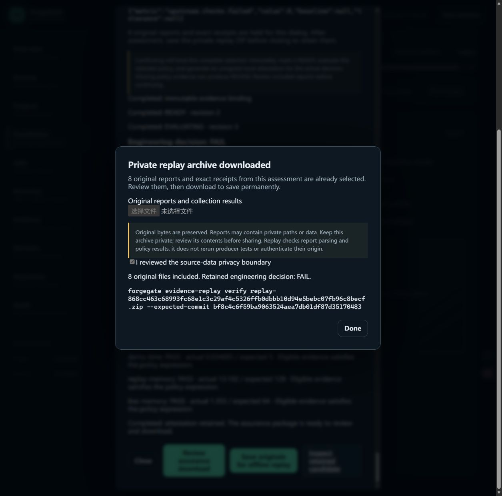

# Phase 56 — real AVS reports through quick assessment

Date: 2026-09-08  
Status: **IMPLEMENTED; LOCAL BROWSER AND OFFLINE ACCEPTANCE PASS**

## Outcome

The shorter Dashboard workflow now accepts the retained real AVS host-report
set without falsifying tool identities, discarding its coverage warning or
weakening the consumer policy. Four reports were selected once, an existing
compatible policy was explicitly selected without uploading a policy file, and
the reviewed workflow produced an independently replayable private handoff.

**Integration PASS; engineering decision FAIL.** The 12 rule results exactly
match Phase 50: ten PASS and two FAIL. There are still 2,470 test results with
one failure, zero errors, 100% measured statement coverage and 15 untriaged Ruff
review candidates. These are not 15 confirmed vulnerabilities. The original
commit is `bf8c4c6f59ba9063524aea7db01df87d35170483`; no newer AVS worktree or
hardware was accessed and no producer tests were rerun.

## Real-input gaps and bounded changes

| Observed gap | Change | Verification |
|---|---|---|
| pytest and coverage.py have different versions and output times | Optional coverage tool/version and per-family time overrides; blank values inherit existing defaults | Real bytes use pytest 8.4.2, coverage.py 7.16.0 and original receipt timestamps; missing paired values/future/offset-free times fail before writes |
| `COVERAGE_BRANCH_SUMMARY_ONLY` prevents the old quick shortcut | Explicit displayed-warning consent followed by read-only repreview; exact result and receipt comparison before assessment | Unchecked consent refused; candidate still COLLECTING revision 1 and unbound after repreview; warning disposition remains retained |
| 533,011-byte XML has 14,134 elements, exceeding the old UI cap | Coverage-only element cap increased from 10,000 to 25,000; 1 MiB/file and depth 32 retained | Actual report completes; exactly 25,000 elements accepted and 25,001 rejected |

No new collector, storage schema, policy threshold, upstream import, cloud
service or hardware surface was added. Warning acceptance is not assessment:
the operator still separately authorizes binding/evaluation/attestation. Rejected
reports and more than 25 warnings per report cannot use this shortcut.

## Browser and output evidence

Actual Windows Edge used a new isolated workspace. Inputs were recovered by
their hashes from the previously downloaded Phase 51 replay archive, whose
SHA-256 and expected producer commit were verified before use. The pack was
registered afresh and the original assembly evaluated once to seed a compatible
saved policy. Fresh registration creates a new authority identity; historical
profile IDs were not copied or misrepresented. The selected policy's original
artifact hash and all policy contents are unchanged.

1. Chose the saved `host-review` policy and selected the four exact raw reports.
2. Entered the distinct source tools and the original per-report timestamps.
3. Parsed all reports; observed and explicitly retained the coverage warning.
4. Confirmed assessment; revision 4, FAIL, 130 normalized records and attestation.
5. Saved the eight already prepared original/receipt files without reselection.
6. Independently verified the actual 1,296,775-byte browser download:
   **VALID / FAIL**, four collections, 130 records, eight source files.
7. Compared against the original handoff: all 130 records match after excluding
   only `artifact.path_or_uri` (file references become content-addressed upload
   references); all 12 complete rule results and warning disposition match
   exactly. The downloaded assurance document equals database readback.

Raw report hashes, collector identities/times, rule comparison results, downloaded
archive identity and screenshot hashes are in the
[machine evidence](PHASE_56_AVS_QUICK_ACCEPTANCE_EVIDENCE.json).
Browser error/warning inspection returned no entries. The accepted UI still
shows a bounded sample of normalized records, while the complete 130 records
are retained and verified in the package.

## Development verification

- `python tools/verify.py`: exit 0 / PASS; 1,433 passed, three environment
  symlink-permission skips; 95.80% branch-aware coverage. Lint, formatting, mypy,
  asset inventory, interaction smoke and exported contract gates pass.
- `npm run test:dashboard`: 210 passed, including ten new metadata/warning
  interaction cases. TypeScript check and packaged Dashboard build pass.
- Three new Python cases cover exact XML element boundaries and unchanged
  warning receipts with distinct tool/time metadata.
- `python tools/release_smoke.py`: exit 0 / PASS, current runtime/assets installed
  from a fresh-sdist-derived wheel. Final acceptance documentation was updated
  afterward; this is not a clean-commit release artifact.

During development, the expanded form exposed a mock-DOM empty-input mismatch;
explicit empty defaults fixed it and all prior frontend cases pass. An initial
private setup incorrectly expected a fresh registration to reuse a historical
profile ID. That assertion stopped setup; preparation was corrected to preserve
policy bytes while using the new workspace's authority. No historical store or
producer record was rewritten.

## Benefit and limits

This run demonstrates an actual reduction in required repeated input: one report
selection, no policy upload and no manual receipt gathering for replay. It does
not establish a measured human speedup or improved human accuracy; Phase 53B
measurement remains deferred. Original files remain in browser memory until
saved, so download before closing the assessment.

Replay re-parses archived software reports and reproduces their policy decision;
it does not prove producer authenticity, the latest AVS state, physical behavior
or production readiness. The user service was not replaced; GitHub remains paused.

Next useful slice: compare two evaluated candidates and identify new failures,
resolved rules and missing evidence, while explicitly flagging different policy
or profile authority. This directly supports repeated release review.
