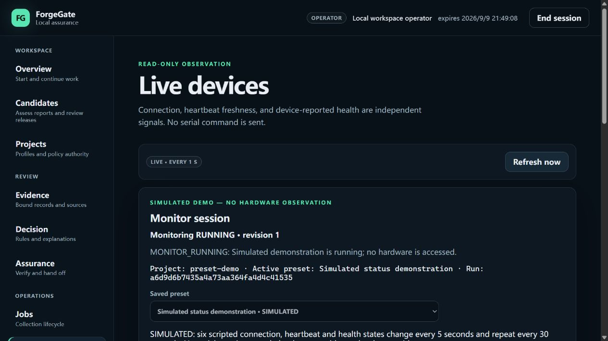
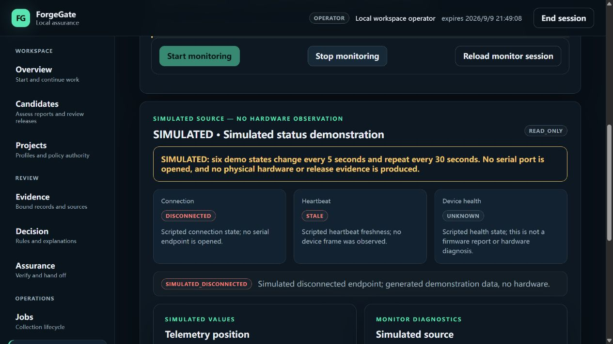

# Phase 64 — reusable monitor presets

Date: 2026-09-09 (local). Scope: owner-selected usability and extensibility slice.
Status: LOCAL ENGINEERING PASS. Development verification and final clean-install
release smoke both completed successfully. [Machine-readable summary](PHASE_64_MONITOR_PRESETS_EVIDENCE.json).

## Implemented task

Save a local, versioned project-scoped catalog once; select an allowlisted preset
in Live devices; start, inspect and stop a single monitor. Supported adapters are
MSP430 UART v1 read-only telemetry and a hardware-free, six-state simulation.
The catalog contains no credentials or executable code. Startup remains stopped.
Browser refresh is not monitor startup; stopping monitoring is not server shutdown.

Local adapter configuration is registered separately from domain-neutral evidence
schemas. Core schema neutrality remains an unchanged regression requirement.

## Validation

- 63 focused BFF/CLI cases pass: authentication, exact Origin, CSRF, role/project
  scope, stale revision/run conflicts, no-overwrite initialization, bounded JSON,
  startup cleanup and existing-pair hardware refusal.
- 57 controller/MSP430 host cases pass, including deterministic six-state outputs,
  no serial import during simulation, duplicate starts, failed starts, stop
  timeouts and blocked reader reuse. These are host tests, not a new board run.
- Full `tools/verify.py`: PASS; 1,568 Python tests pass / 3 environment symlink
  skips, 95.90% branch-aware coverage; 33 interaction checks, strict typing,
  lint/format, static assets, JSON Schema and both OpenAPI drift checks pass.
- 296 frontend cases pass (31 new), plus TypeScript and production build checks.
- Clean-install release smoke: PASS before and after the registry correction.
  The final smoke rebuilt and checked its own package; it is not falsely reported
  as the same byte-identical wheel used for the separately identified browser run.
- Actual in-app browser: operator activation, STOPPED/revision0,
  Start/RUNNING1, visible normal/invalid/fault simulation states, Stop/STOPPED2,
  reload still STOPPED2, keyboard Tab/Enter start/RUNNING3 with a distinct run ID,
  reload retaining that run ID. No console warnings/errors were observed; no
  horizontal overflow at the observed 1280×720 CSS viewport.
- The final wheel was then installed into the same isolated environment after
  the explicitly stopped demo and identified test server were shut down. New
  browser authorization was required; the saved catalog returned STOPPED/revision0
  rather than adopting the previous run. A fresh start succeeded. Stale,
  disconnected and recovery states were also observed; final screenshots below
  come from this refreshed installation. Its `serial` module is absent. Final
  stop returned STOPPED/revision2; the service and authenticated test page remain
  available for the owner to start the simulation. No monitor is left running.
- Automated tests, not manual screenshot sampling, verify all six exact scripted
  states. Native screen readers, full zoom matrices and physical ports were not
  retested in this slice.

## Retained browser evidence

These are actual screenshots from an independently installed wheel and isolated
workspace. The board data is deliberately simulated and visibly labeled.

Final local wheel: `forgegate-0.1.0a1-py3-none-any.whl`, 372,650 bytes,
120 members, five inventoried Dashboard assets. SHA-256:
`29b8a68ebbf979645282e5bdb9c626dc03a64f77d3cae2e27599cbb627e85f7c`.
The build source was the working tree based on `9b9230e`; subsequent acceptance
notes and screenshots do not alter runtime code. Local build receipt is retained
under `work/phase64-monitor/final-delivery`; detailed command logs are retained
under `work/phase64-*`, excluded from Git. The recorded screenshot hashes identify
the final captures, not the preliminary images included in the build-time sdist.

## Corrections and evidence limits

The first full gate reported 1,567 passes / 1 failure / 3 environment symlink skips
and 95.90% branch-aware coverage. The failure was the unchanged domain-neutral
core-schema check: the new adapter-specific local catalog had been included in
the core registry. It was moved into a separate local-configuration registry;
export, drift checks and doctor output now include that explicit category.
The targeted 42 configuration/schema tests passed after the correction.

The first full-page capture contained a dynamic-page stitching artifact. It was
replaced with direct viewport captures, without editing or compositing screenshots.
Two browser locator waits timed out; current accessibility state and standard
keyboard navigation completed the interaction checks. Those harness attempts are
not recorded as product test passes.

This is a local working-tree delivery, not a public release or clean-commit
publication. No hardware commands, serial access, firmware write, new upstream
test run, GitHub publication, or measured human-efficiency claim is made.
Saved settings remove repeat configuration entry, but comparative time savings
and accuracy improvement remain unmeasured.

## Remaining scope

Live status does not yet export a durable measurement capture. No second physical
board is verified. There is no arbitrary driver loading, automatic COM discovery,
browser preset editing, multi-process device broker, Windows autostart or automatic
login. See [usage and extension criteria](../docs/MONITOR_PRESETS.md).
